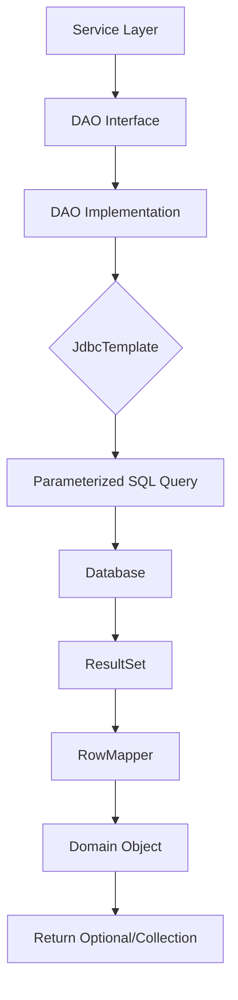

# Data Access Object (DAO) Implementation with Spring JDBC

## Overview

- **DAO Pattern**: Clean abstraction over database access.
- **Spring JDBC**: Leverages `JdbcTemplate` for simplified database interactions.
- **Custom RowMappers**: Specialized mapping from ResultSet to domain objects.
- **Parameterized Queries**: Secure against SQL injection.
- **Optional Handling**: Find operations return `Optional` for null-safe operations.

## Table of Contents

- [Overview](#overview)
- [Project Structure](#project-structure)
- [Domain Models](#domain-models)
- [DAO Interfaces](#dao-interfaces)
- [DAO Implementations](#dao-implementations)
- [Data Mapping Utilities](#data-mapping-utilities)
- [Database Configuration](#database-configuration)
- [Key Patterns and Nuances](#key-patterns-and-nuances)


## Project Structure

```
src/main/java/com/example/jdbc/dao/
├── DaoApplication.java           # Spring Boot main class with startup logic
├── dao/
│   ├── AuthorDao.java            # Interface defining Author CRUD operations
│   ├── BookDao.java              # Interface defining Book CRUD operations
│   └── impl/
│       ├── AuthorDaoImpl.java    # JdbcTemplate-based implementation
│       ├── BookDaoImpl.java      # JdbcTemplate-based implementation
│       └── RowMapper/
│           └── AuthorRowMapper.java # Custom RowMapper for Author entity
├── domain/
│   ├── Author.java               # Author domain model
│   └── Book.java                 # Book domain model
└── README.md                     # This documentation
```

```mermaid
classDiagram
    class DaoApplication {
        +run(...): void
    }
    note for DaoApplication "Spring Boot app with CommandLineRunner\nVerifies DataSource connectivity"

    interface AuthorDao {
        <<interface>>
        +create(Author): void
        +findOne(Long): Optional<Author>
        +find(): List<Author>
        +update(Author, Long): void
        +delete(Long): void
    }

    interface BookDao {
        <<interface>>
        +create(Book): void
        +findOne(String): Optional<Book>
        +find(): List<Book>
        +update(Book, String): void
        +delete(String): void
    }

    class AuthorDaoImpl {
        +jdbcTemplate: JdbcTemplate
        +authorRowMapper: AuthorRowMapper
        +create(Author): void
        +findOne(Long): Optional<Author>
        +find(): List<Author>
        +update(Author, Long): void
        +delete(Long): void
    }

    class BookDaoImpl {
        +jdbcTemplate: JdbcTemplate
        +create(Book): void
        +findOne(String): Optional<Book>
        +find(): List<Book>
        +update(Book, String): void
        +delete(String): void
    }

    class AuthorRowMapper {
        +mapRow(ResultSet, int): Author
    }

    class BookRowMapper {
        +mapRow(ResultSet, int): Book
    }
    note for BookRowMapper "Static inner class in BookDaoImpl"

    class Author {
        +id: Long
        +name: String
        +age: Integer
    }

    class Book {
        +isbn: String
        +title: String
        +authorId: Long
    }

    DaoApplication --> AuthorDao
   DaoApplication --> BookDao
    AuthorDao <|.. AuthorDaoImpl: implements
    BookDao <|.. BookDaoImpl: implements
    AuthorDaoImpl --> AuthorRowMapper: uses
    BookDaoImpl --> BookRowMapper: uses
    AuthorRowMapper ..> Author: maps to
    BookRowMapper ..> Book: maps to
    AuthorDaoImpl --> Author: CRUD
    BookDaoImpl --> Book: CRUD
    Book --> Author: authorId foreign key reference
```

## Domain Models

### Author Entity

The `Author` class represents an author entity with auto-generated ID using database sequence ([Author.java](domain/Author.java)).

```java
@Data
@AllArgsConstructor
@NoArgsConstructor
@Builder
public class Author {
    private Long id;        // Primary key, generated by sequence
    private String name;    // Author's full name
    private Integer age;    // Author's age in years
}
```

**Key Characteristics:**
- Uses Lombok annotations for boilerplate reduction (`@Data`, `@AllArgsConstructor`, etc.).
- `@Builder` provides fluent construction pattern.
- ID is `Long` type, generated by PostgreSQL sequence.
- Mapped to `authors` table.

### Book Entity

The `Book` class represents a book entity with ISBN as primary identifier ([Book.java](domain/Book.java)).

```java
@Data
@AllArgsConstructor
@NoArgsConstructor
@Builder
public class Book {
    private String isbn;    // Primary key, industry-standard book identifier
    private String title;   // Book title
    private Long authorId;  // Foreign key to Author entity
}
```

**Key Characteristics:**
- ISBN serves as primary key (String type).
- References Author via `authorId` (enforces foreign key constraint).
- Builder pattern for flexible object construction.

## DAO Interfaces

Standardized CRUD interfaces define the contract for data access operations.

### AuthorDao Interface ([AuthorDao.java](dao/AuthorDao.java))

```java
public interface AuthorDao {
    void create(Author author);
    Optional<Author> findOne(Long authorId);
    List<Author> find();
    void update(Author author, Long id);
    void delete(Long id);
}
```

### BookDao Interface ([BookDao.java](dao/BookDao.java))

```java
public interface BookDao {
    void create(Book book);
    Optional<Book> findOne(String isbn);
    List<Book> find();
    void update(Book book, String isbn);
    void delete(String isbn);
}
```

**Interface Design Patterns:**
- Return `Optional<T>` for findOne to handle non-existent records null-safely.
- Use entity ID as parameter for single-record operations.
- Consistent naming across entities.

## DAO Implementations


All DAO implementations follow these principles:

- **Spring-managed Components**: Annotated with `@Component` for dependency injection.
- **JdbcTemplate Injection**: Constructor-injected for database operations.
- **Parameterized Queries**: Prevent SQL injection with `?` placeholders.
- **Transactional Awareness**: Integrates with Spring's transaction management.

### AuthorDaoImpl ([AuthorDaoImpl.java](dao/impl/AuthorDaoImpl.java))

```java
@Component
public class AuthorDaoImpl implements AuthorDao {
    private final JdbcTemplate jdbcTemplate;
    private final AuthorRowMapper authorRowMapper;

    public AuthorDaoImpl(JdbcTemplate jdbcTemplate, AuthorRowMapper authorRowMapper) {
        this.jdbcTemplate = jdbcTemplate;
        this.authorRowMapper = authorRowMapper;
    }

    // CRUD implementations using jdbcTemplate.update() and jdbcTemplate.query()
}
```

### BookDaoImpl ([BookDaoImpl.java](dao/impl/BookDaoImpl.java))

Notably uses a **static inner `RowMapper`** instead of injected component.

```java
@Component
public class BookDaoImpl implements BookDao {
    private final JdbcTemplate jdbcTemplate;

    public BookDaoImpl(JdbcTemplate jdbcTemplate) {
        this.jdbcTemplate = jdbcTemplate;
    }

    // Similar CRUD pattern, uses BookRowMapper static inner class
}

public static class BookRowMapper implements RowMapper<Book> {
    // BookRowMapper implementation
}
```

## Data Mapping Utilities

**Mapping Details:**
- Uses Builder pattern for clean object construction.
- **AuthorDao**: Separate `@Component` class - promotes reusability across DAOs.
- **BookDao**: Static inner class - keeps mapping logic co-located with DAO.

### RowMapper Pattern

`RowMapper<T>` converts `ResultSet` rows to domain objects.

### AuthorRowMapper ([AuthorRowMapper.java](dao/impl/RowMapper/AuthorRowMapper.java))

```java
@Component
public class AuthorRowMapper implements RowMapper<Author> {
    @Override
    public Author mapRow(ResultSet rs, int rowNum) throws SQLException {
        return Author.builder()
                .id(rs.getLong("id"))
                .name(rs.getString("name"))
                .age(rs.getInt("age"))
                .build();
    }
}
```

### BookRowMapper (Static Inner)

Defined as static inner class for encapsulation.

```java
public static class BookRowMapper implements RowMapper<Book> {
    @Override
    public Book mapRow(ResultSet rs, int rowNum) throws SQLException {
        return Book.builder()
                .isbn(rs.getString("isbn"))
                .title(rs.getString("title"))
                .authorId(rs.getLong("author_id"))
                .build();
    }
}
```

## Database Configuration

### Schema ([schema.sql](../../resources/schema.sql))

- Authors use sequence-generated IDs.
- Books use ISBN (String) as primary key.
- Foreign key ensures referential integrity.
- Nullable fields: location (authors), title, author_id (books).

### Application Configuration ([application.properties](../../resources/application.properties))

Configured via application.properties for database connection (likely H2/PostgreSQL for testing/production).

## Key Patterns and Nuances

### CRUD Operation Flow



### Technical Nuances

- **Optional Returns**: Mitigates null pointer exceptions.
- **Builder Pattern**: Simplifies object construction in RowMappers.
- **Sequence vs. Natural Keys**: Author uses generated IDs; Book uses ISBN (industry standard).
- **RowMapper Strategies**: Component vs. inner class based on reusability needs.
- **Foreign Key Relationships**: Book.authorId maps to Author.id.
