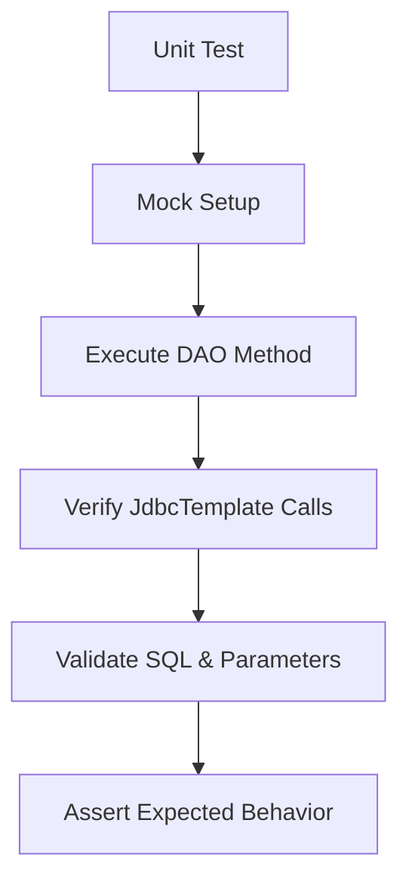
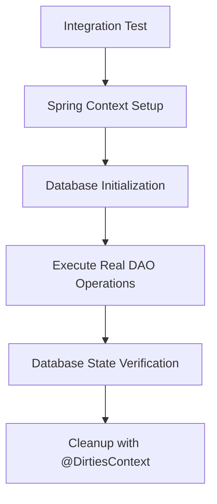

# Test Implementation Documentation

## Overview

Comprehensive testing strategy with both **unit tests** and **integration tests** to ensure the reliability and correctness of the DAO layer implementations.
The tests validate all CRUD operations for both `Author` and `Book` entities while maintaining proper isolation and test data management.

## Table of Contents

- [Overview](#overview)
- [Test Structure](#test-structure)
- [Unit Testing](#unit-testing)
- [Integration Testing](#integration-testing)
- [Test Utilities](#test-utilities)
- [Test Scenarios](#test-scenarios)
- [Key Testing Patterns](#key-testing-patterns)

## Test Structure

```
src/test/java/com/example/jdbc/dao/
├── DaoApplicationTests.java                    # Basic Spring Boot context test
├── dao/
│   └── Impl/
│       ├── AuthorDaoImplTest.java             # Unit tests for Author DAO
│       ├── BookDaoImplTest.java               # Unit tests for Book DAO
│       └── IntegrationTest/
│           ├── AuthorDaoImplIntegrationTest.java  # Integration tests for Author DAO
│           └── BookDaoImplIntegrationTest.java    # Integration tests for Book DAO
└── util/
    ├── Constants.java                         # Test constants and data
    └── TestDataUtil.java                      # Test data builder utilities
```

## Unit Testing

### Mockito-Based Testing Strategy

Unit tests use **Mockito** framework to isolate DAO implementations from actual database dependencies, focusing on testing the SQL generation and method behavior.

#### Unit Tests

**Test Configuration:**
```java
@ExtendWith(MockitoExtension.class)
public class AuthorDaoImplTest {

    @Mock
    private JdbcTemplate jdbcTemplate;

    @InjectMocks
    private AuthorDaoImpl authorDaoImpl;
}
```

**CRUD Operation Verification:**

- **Create Operation**: Verifies INSERT SQL generation with proper parameter binding
  ```java
  verify(jdbcTemplate).update(
      eq("INSERT INTO authors (id, name, age) VALUES (?,?,?)"),
      eq(ID), eq(NAME), eq(AGE)
  );
  ```

- **Read Operations**: Validates SELECT queries with LIMIT for single record retrieval
  ```java
  verify(jdbcTemplate).query(
      eq("SELECT id, name, age FROM authors WHERE id = ? LIMIT 1"),
      ArgumentMatchers.<AuthorRowMapper>any(),
      eq(ID)
  );
  ```

- **Update Operation**: Confirms UPDATE statements with WHERE clause
  ```java
  verify(jdbcTemplate).update(
      eq("UPDATE authors SET id = ?, name = ?, age = ? WHERE id = ?"),
      eq(ID_3), eq(NAME), eq(AGE), eq(ID_3)
  );
  ```

- **Delete Operation**: Validates DELETE statements with proper conditions
  ```java
  verify(jdbcTemplate).update(
      eq("DELETE FROM authors WHERE id = ?"),
      eq(ID)
  );
  ```

## Integration Testing

### Test Configuration

```java
@SpringBootTest
@ExtendWith(SpringExtension.class)
@DirtiesContext(classMode = DirtiesContext.ClassMode.AFTER_EACH_TEST_METHOD)
public class AuthorDaoImplIntegrationTest {

    @Autowired
    private AuthorDaoImpl authorDaoImpl;
}
```

### Test Database Configuration

The integration tests use a dedicated test database defined in [application.properties](src/test/resources/application.properties):

```properties
spring.datasource.url=jdbc:h2:mem:testdb;MODE=PostgreSQL;DATABASE_TO_LOWER=TRUE;DEFAULT_NULL_ORDERING=HIGH
spring.datasource.username=sa
spring.datasource.password=password
spring.datasource.driver-class-name=org.h2.Driver
```

**Configuration Breakdown:**

- **In-Memory Database**: `jdbc:h2:mem:testdb` creates a temporary H2 database in memory
  - Fast test execution with no disk I/O overhead
  - Database is created fresh for each test run
  - Automatically destroyed when tests complete

- **PostgreSQL Compatibility Mode**: `MODE=PostgreSQL` configures H2 to emulate PostgreSQL behavior
  - Ensures SQL syntax compatibility with production PostgreSQL database
  - Maintains consistent behavior between test and production environments

- **Case Handling**: `DATABASE_TO_LOWER=TRUE` converts all unquoted identifiers to lowercase
  - Prevents case-sensitivity issues between different database systems
  - Ensures consistent table and column name handling

- **Null Ordering**: `DEFAULT_NULL_ORDERING=HIGH` sets null values to sort last
  - Provides predictable query result ordering
  - Matches PostgreSQL's default null handling behavior

**Test Database Benefits:**

- **Isolation**: Each test runs against a clean database instance
- **Speed**: In-memory operations eliminate disk access latency
- **Consistency**: Identical configuration across all integration tests
- **Reliability**: No external database dependencies or network issues
- **Portability**: Tests can run in any environment without database setup

### Test Isolation Strategy

- **`@DirtiesContext`**: Ensures clean database state between tests
- **Real database operations**: Tests actual JDBC template execution
- **Transaction management**: Leverages Spring's test transaction handling
- **Relationship-Aware Testing**: Tests foreign key relationship handling

### Dependency Injection in Tests

**Mockito Patterns**:
- `@Mock`: Creates mock objects for dependencies
- `@InjectMocks`: Injects mocks into the class under test
- `@ExtendWith(MockitoExtension.class)`: Enables Mockito integration

**Spring Test Patterns**:
- `@Autowired`: Injects real Spring-managed beans
- `@SpringBootTest`: Loads complete application context
- `@DirtiesContext`: Manages test isolation

## Test Utilities

### Constants Management
- Centralized Test Data: [Constants.java](src/test/java/com/example/jdbc/dao/util/Constants.java)

### Test Data Builder Pattern
- Utility Class: [TestDataUtil.java](src/test/java/com/example/jdbc/dao/util/TestDataUtil.java)

## Test Scenarios

| Entity | Operation       | Unit Test | Integration Test | Edge Cases              |
|--------|-----------------|-----------|------------------|-------------------------|
| Author | Create          | ✅         | ✅                | Null validation         |
| Author | Read (Single)   | ✅         | ✅                | Non-existent ID         |
| Author | Read (Multiple) | ✅         | ✅                | Empty results           |
| Author | Update          | ✅         | ✅                | Concurrent updates      |
| Author | Delete          | ✅         | ✅                | Cascade effects         |
| Book   | Create          | ✅         | ✅                | Foreign key constraints |
| Book   | Read (Single)   | ✅         | ✅                | ISBN format validation  |
| Book   | Read (Multiple) | ✅         | ✅                | Author relationship     |
| Book   | Update          | ✅         | ✅                | Referential integrity   |
| Book   | Delete          | ✅         | ✅                | Orphaned records        |

## Key Testing Patterns

### Mock Verification Strategy



### Integration Test Flow



## Running Tests

```bash
# Run all tests
mvn test
```
