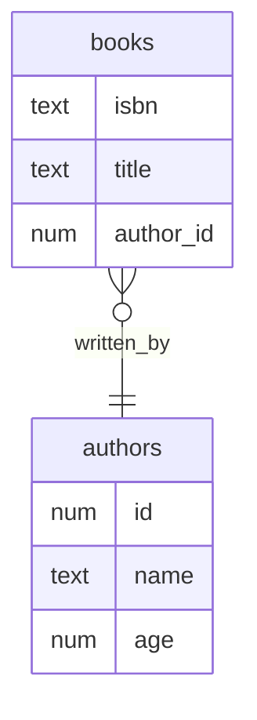
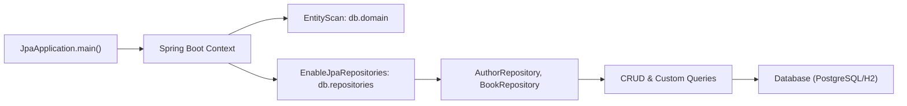
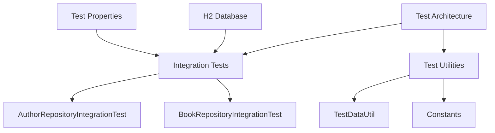

# Spring Boot JPA

## Table of Contents
- [Overview](#overview)
- [Features](#features)
- [Project Structure](#project-structure)
- [Entity Relationship Diagram](#entity-relationship-diagram)
- [Application Flow](#application-flow)
- [Detailed Logic](#detailed-logic)
- [Key Annotations](#key-concepts--annotations)
- [Testing](#testing)

## Overview

This project demonstrates use of Spring Boot with Spring Data JPA, Hibernate, and PostgreSQL for prod (with H2 for tests). 
It models a simple library system with [Author](src/main/java/com/example/db/domain/Author.java) and [Book](src/main/java/com/example/db/domain/Book.java) entities, and provides repository interfaces for CRUD and custom queries.

---

### Features

- **Spring Boot**: Rapid application setup and configuration.
- **Spring Data JPA**: Repository abstraction for CRUD and custom queries.
- **Hibernate**: ORM for entity mapping and schema management.
- **PostgreSQL**: Production database.
- **H2**: In-memory database for fast, isolated testing.
- **Lombok**: Reduces boilerplate in entity and utility classes.
- **Integration Tests**: Verifies repository logic against a real database context.
- **Builder Pattern**: Used for test data creation.
- **Separation of Concerns**: Clear package structure for domain, repository, and utility logic.


### Project Structure

```
src/
├── main/
│   ├── java/
│   │   └── com/
│   │       └── example/
│   │           ├── db/
│   │           │   ├── domain/
│   │           │   │   ├── Author.java          # Author entity class
│   │           │   │   └── Book.java            # Book entity class
│   │           │   └── repositories/
│   │           │       ├── AuthorRepository.java    # Repository for Author entities
│   │           │       └── BookRepository.java      # Repository for Book entities
│   │           └── jpa/
│   │               └── JpaApplication.java      # Main Spring Boot application
│   └── resources/
│       └── application.properties            # Main application configuration
└── test/
    ├── java/
    │   └── com/
    │       └── example/
    │           ├── db/
    │           │   ├── repositories/
    │           │   │   ├── AuthorRepositoryIntegrationTest.java    # Integration tests for AuthorRepository
    │           │   │   └── BookRepositoryIntegrationTest.java       # Integration tests for BookRepository
    │           │   └── util/
    │           │       ├── Constants.java        # Test data constants
    │           │       └── TestDataUtil.java     # Utility for building test data
    │           └── jpa/
    │               └── JpaApplicationTests.java  # Main application tests
    └── resources/
        └── application.properties        # Test application configuration
```

### Entity Relationship Diagram



---

### Application Flow



---

### Detailed Logic

#### 1. [Author](src/main/java/com/example/db/domain/Author.java) (Entity)
- Annotated with `@Entity` and `@Table(name = "authors")` for JPA mapping.
- Uses Lombok (`@Data`, `@Builder`, etc.) for boilerplate reduction.
- Fields:
  - `id`: Primary key, auto-generated with sequence.
  - `name`, `age`: Author details.
- **Key Annotations:**
  - `@Id`, `@GeneratedValue`: Primary key and auto-generation.
  - `@Entity`, `@Table`: JPA entity/table mapping.

#### 2. [Book](src/main/java/com/example/db/domain/Book.java) (Entity)
- Annotated with `@Entity` and `@Table(name = "books")`.
- Fields:
  - `isbn`: Primary key (String).
  - `title`: Book title.
  - `authorId`: Many-to-one relationship to `Author`.
- **Key Annotations:**
  - `@ManyToOne`: Many books can be written by one author.
  - `@JoinColumn(name = "author_id")`: Foreign key column.
  - `CascadeType.ALL`: Changes to books cascade to authors.

**NOTE:** 
In the `Book` entity, the @ManyToOne relationship to Author is annotated with cascade = `CascadeType.ALL`. 
This means that all JPA lifecycle operations (persist, merge, remove, detach, refresh) performed on a `Book` entity will automatically cascade to its associated `Author` entity.
While `CascadeType.ALL` works here, it's unconventional for `@ManyToOne` associations. Typically you'd want Authors to exist independently of Books.
In production, you might consider using `CascadeType.PERSIST` and `CascadeType.MERGE` instead to allow Author creation with Books but prevent accidental Author deletion when deleting Books.

#### 3. [AuthorRepository](src/main/java/com/example/db/repositories/AuthorRepository.java) (Repository)
- Extends `CrudRepository<Author, Long>`.
- **Custom Query Methods:**
  1. `Iterable<Author> ageLessThan(int age);`: Derived query (auto-implemented by Spring Data). Spring Data JPA can auto-generate repository implementations based on method names and signatures.
  2. `@Query("SELECT a from Author a where a.age > ?1")`: JPQL custom query.
  3. `@Query(value = "SELECT * FROM authors WHERE name = ?", nativeQuery = true)`: Native SQL query.

#### 4. [BookRepository](src/main/java/com/example/db/repositories/BookRepository.java) (Repository)
- Extends `CrudRepository<Book, String>`.
- No custom methods, but inherits all CRUD operations.

#### 5. [application.properties](src/main/resources/application.properties) 
- Configures PostgreSQL datasource and Hibernate DDL auto-update.
- `spring.jpa.hibernate.ddl-auto=update`: Automatically updates schema to match entities.
- Configures H2 in-memory database for tests.
- Enables H2 console for debugging.

```properties
  spring.datasource.url=jdbc:postgresql://localhost:5432/mydb
  spring.datasource.username=myuser
  spring.datasource.password=mypassword
  spring.jpa.hibernate.ddl-auto=update
  spring.h2.console.enabled=true
  spring.h2.console.path=/h2-console
  ```

---

### Key Concepts & Annotations

- **@Entity, @Table**: JPA entity mapping.
- **@Id, @GeneratedValue**: Primary key and auto-generation.
- **@ManyToOne, @JoinColumn**: Entity relationships.
- **@Repository**: Marks interfaces as Spring Data repositories.
- **@Query**: Custom JPQL/native queries.
- **@SpringBootApplication, @EntityScan, @EnableJpaRepositories**: Spring Boot and JPA configuration.

---

### Testing

#### Testing Architecture



#### Test Configuration

- **Database**: Uses H2 in-memory database for tests
- **Test Properties**: [application.properties](src/test/resources/application.properties)
  ```properties
  spring.datasource.url=jdbc:h2:mem:testdb;MODE=PostgreSQL
  spring.datasource.driver-class-name=org.h2.Driver
  spring.h2.console.enabled=true
  ```
- **Test Annotations**:
  - `@SpringBootTest`: Provides full Spring context
  - `@DirtiesContext`: Ensures clean state between tests
- **Database State Management**:
  - Each test method runs with a clean database state
  - `@DirtiesContext` ensures no cross-test contamination
  - H2 in-memory database provides fast test execution
- **Integration Test Strategy**:
  - Tests full stack from repository to database
  - Validates JPA mappings and relationships
  - Verifies custom query implementations
- **Test Utilities**:
    - [TestDataUtil](src/test/java/com/example/db/util/TestDataUtil.java) provides utility methods for creating test data:
    - [Constants](src/test/java/com/example/db/util/Constants.java) Centralizes test constants

#### Key Tests

- **Creation Tests**: Verify entities can be created and persisted
- **Query Tests**: Validate custom queries like `ageLessThan` and JPQL queries
- **Empty State Tests**: Ensure correct behavior with no data
- **Relationship Tests**: Validate Many-to-One relationships work correctly
- **Cascade Tests**: Ensure cascading operations work as expected
