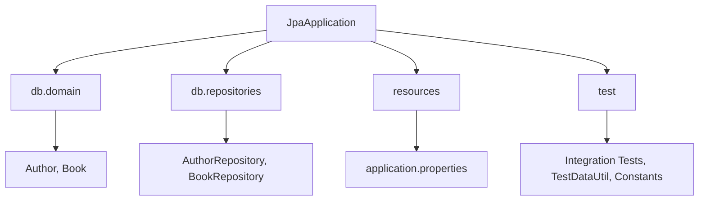
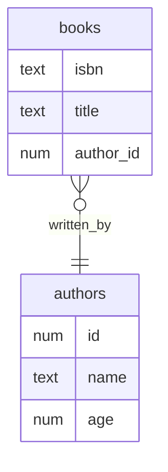
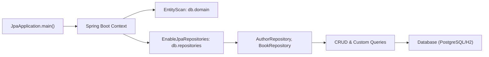
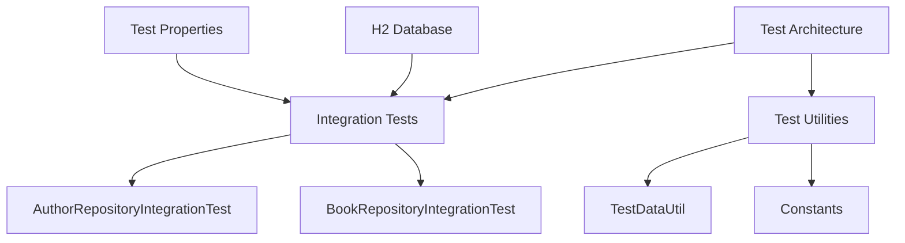

# Spring Boot JPA

## Table of Contents
- [Overview](#overview)
- [Features](#features)
- [Project Structure](#project-structure)
- [Entity Relationship Diagram](#entity-relationship-diagram)
- [Application Flow](#application-flow)
- [Detailed File/Logic Notes](#detailed-filenotes)
  - [Author Entity](#1-authorjava-entity)
  - [Book Entity](#2-bookjava-entity)
  - [AuthorRepository](#3-authorrepositoryjava-repository)
  - [BookRepository](#4-bookrepositoryjava-repository)
  - [JpaApplication](#5-jpaapplicationjava-main-application)
  - [Application Properties (Main)](#6-applicationproperties-main)
  - [Application Properties (Test)](#7-applicationproperties-test)
  - [Integration Tests](#8-integration-tests)
  - [Test Utilities](#9-test-utilities)
- [Key Concepts & Annotations](#key-concepts--annotations)
- [Nuances & Best Practices](#nuances--best-practices)
- [Hibernate auto DDL](#hibernate-auto-ddl)
- [Spring Data JPA](#spring-data-jpa)
- [Testing](#testing)

## Overview

This project demonstrates a clean, idiomatic use of Spring Boot with Spring Data JPA, Hibernate, and PostgreSQL (with H2 for tests). It models a simple library system with [`Author`](src/main/java/com/example/db/domain/Author.java) and [`Book`](src/main/java/com/example/db/domain/Book.java) entities, and provides repository interfaces for CRUD and custom queries. The project is structured for clarity, testability, and extensibility.

---

### Features

- **Spring Boot**: Rapid application setup and configuration.
- **Spring Data JPA**: Repository abstraction for CRUD and custom queries.
- **Hibernate**: ORM for entity mapping and schema management.
- **PostgreSQL**: Production database.
- **H2**: In-memory database for fast, isolated testing.
- **Lombok**: Reduces boilerplate in entity and utility classes.
- **Integration Tests**: Verifies repository logic against a real database context.
- **Builder Pattern**: Used for test data creation.
- **Separation of Concerns**: Clear package structure for domain, repository, and utility logic.

---

### Project Structure



- **db.domain**: JPA entity classes ([`Author`](src/main/java/com/example/db/domain/Author.java), [`Book`](src/main/java/com/example/db/domain/Book.java))
- **db.repositories**: Spring Data JPA repository interfaces ([`AuthorRepository`](src/main/java/com/example/db/repositories/AuthorRepository.java), [`BookRepository`](src/main/java/com/example/db/repositories/BookRepository.java))
- **jpa**: Main application entry point ([`JpaApplication`](src/main/java/com/example/jpa/JpaApplication.java))
- **resources**: Configuration files ([`application.properties`](src/main/resources/application.properties))
- **test**: Integration tests and test utilities ([`AuthorRepositoryIntegrationTest`](src/test/java/com/example/db/repositories/AuthorRepositoryIntegrationTest.java), [`BookRepositoryIntegrationTest`](src/test/java/com/example/db/repositories/BookRepositoryIntegrationTest.java), [`TestDataUtil`](src/test/java/com/example/db/util/TestDataUtil.java), [`Constants`](src/test/java/com/example/db/util/Constants.java))

---

### Entity Relationship Diagram



---

### Application Flow



---

### Detailed File/Logic Notes

#### 1. [`Author.java`](src/main/java/com/example/db/domain/Author.java) (Entity)
- Annotated with `@Entity` and `@Table(name = "authors")` for JPA mapping.
- Uses Lombok (`@Data`, `@Builder`, etc.) for boilerplate reduction.
- Fields:
  - `id`: Primary key, auto-generated with sequence.
  - `name`, `age`: Author details.
- **Key Annotations:**
  - `@Id`, `@GeneratedValue`: Primary key and auto-generation.
  - `@Entity`, `@Table`: JPA entity/table mapping.

#### 2. [`Book.java`](src/main/java/com/example/db/domain/Book.java) (Entity)
- Annotated with `@Entity` and `@Table(name = "books")`.
- Fields:
  - `isbn`: Primary key (String).
  - `title`: Book title.
  - `authorId`: Many-to-one relationship to `Author`.
- **Key Annotations:**
  - `@ManyToOne`: Many books can be written by one author.
  - `@JoinColumn(name = "author_id")`: Foreign key column.
  - `CascadeType.ALL`: Changes to books cascade to authors.

#### 3. [`AuthorRepository.java`](src/main/java/com/example/db/repositories/AuthorRepository.java) (Repository)
- Extends `CrudRepository<Author, Long>`.
- **Query Methods:**
  - `Iterable<Author> ageLessThan(int age);`: Derived query (auto-implemented by Spring Data).
  - `@Query("SELECT a from Author a where a.age > ?1")`: JPQL custom query.
  - `@Query(value = "SELECT * FROM authors WHERE name = ?", nativeQuery = true)`: Native SQL query.
- **Nuance:** Spring Data JPA can derive queries from method names, but for more complex logic, use `@Query` with JPQL or native SQL.

#### 4. [`BookRepository.java`](src/main/java/com/example/db/repositories/BookRepository.java) (Repository)
- Extends `CrudRepository<Book, String>`.
- No custom methods, but inherits all CRUD operations.

#### 5. [`JpaApplication.java`](src/main/java/com/example/jpa/JpaApplication.java) (Main Application)
- Annotated with `@SpringBootApplication`, `@EntityScan`, `@EnableJpaRepositories`.
- Implements `CommandLineRunner` to log a startup message.
- **Entry Point:** `main()` method runs the Spring Boot app.

#### 6. [`application.properties`](src/main/resources/application.properties) (Main)
- Configures PostgreSQL datasource and Hibernate DDL auto-update.
- `spring.jpa.hibernate.ddl-auto=update`: Automatically updates schema to match entities.

#### 7. [`application.properties`](src/test/resources/application.properties) (Test)
- Configures H2 in-memory database for tests.
- Enables H2 console for debugging.

#### 8. Integration Tests
- [`AuthorRepositoryIntegrationTest.java`](src/test/java/com/example/db/repositories/AuthorRepositoryIntegrationTest.java): Tests author creation, retrieval, and empty state.
- [`BookRepositoryIntegrationTest.java`](src/test/java/com/example/db/repositories/BookRepositoryIntegrationTest.java): Tests book creation (with author), retrieval, and empty state.

#### 9. Test Utilities
- [`Constants.java`](src/test/java/com/example/db/util/Constants.java): Centralizes test data constants (author names, ages, book titles, ISBNs).
- [`TestDataUtil.java`](src/test/java/com/example/db/util/TestDataUtil.java): Static builder methods for creating `Author` and `Book` instances for tests. Uses builder pattern for clarity and immutability.

---

### Key Concepts & Annotations

- **@Entity, @Table**: JPA entity mapping.
- **@Id, @GeneratedValue**: Primary key and auto-generation.
- **@ManyToOne, @JoinColumn**: Entity relationships.
- **@Repository**: Marks interfaces as Spring Data repositories.
- **@Query**: Custom JPQL/native queries.
- **@SpringBootApplication, @EntityScan, @EnableJpaRepositories**: Spring Boot and JPA configuration.
- **@SpringBootTest, @DirtiesContext**: Integration test setup.
- **Lombok**: Reduces boilerplate (getters, setters, constructors, builder).

---

### Nuances & Best Practices

- **Builder Pattern**: Used for test data to ensure immutability and clarity.
- **CascadeType.ALL**: In `Book`, ensures author changes propagate, but be cautious in production to avoid unintended deletions.
- **Integration Testing**: Uses H2 to mimic PostgreSQL, ensuring fast, isolated, and repeatable tests.
- **Separation of Concerns**: Entities, repositories, and utilities are clearly separated for maintainability.

---

### Hibernate auto DDL

```editorconfig
spring.jpa.hibernate.ddl-auto=update
```

---

### Spring Data JPA 

- Without any implementation 

    ```java
    Iterable<Author> ageLessThan(int age);
    ```
  
- Custom methods and queries - [`AuthorRepository`](src/main/java/com/example/db/repositories/AuthorRepository.java)

---

### Testing

### Testing Architecture



#### Integration Tests Overview

The project implements a comprehensive testing strategy focusing on repository integration tests. These tests verify the interaction between our JPA repositories and the database, ensuring that our data access layer works as expected.

##### Test Configuration

- **Database**: Uses H2 in-memory database for tests
- **Test Properties**: [`application.properties`](src/test/resources/application.properties)
  ```properties
  spring.datasource.url=jdbc:h2:mem:testdb;MODE=PostgreSQL
  spring.datasource.driver-class-name=org.h2.Driver
  spring.h2.console.enabled=true
  ```
- **Test Annotations**:
  - `@SpringBootTest`: Provides full Spring context
  - `@DirtiesContext`: Ensures clean state between tests

#### Key Test Components

##### 1. [`AuthorRepositoryIntegrationTest`](src/test/java/com/example/db/repositories/AuthorRepositoryIntegrationTest.java)
Tests the `AuthorRepository` functionality:
- **Creation Tests**: Verify author entities can be created and persisted
- **Query Tests**: Validate custom queries like `ageLessThan` and JPQL queries
- **Empty State Tests**: Ensure correct behavior with no data
- **Test Structure**:
  ```java
  @SpringBootTest
  @DirtiesContext(classMode = DirtiesContext.ClassMode.AFTER_EACH_TEST_METHOD)
  public class AuthorRepositoryIntegrationTest {
      // Each test runs with a clean database state
  }
  ```

##### 2. [`BookRepositoryIntegrationTest`](src/test/java/com/example/db/repositories/BookRepositoryIntegrationTest.java)
Tests the `BookRepository` functionality:
- **Creation Tests**: Verify book entities can be created with author relationships
- **Relationship Tests**: Validate Many-to-One relationships work correctly
- **Cascade Tests**: Ensure cascading operations work as expected
- **Test Structure**:
  ```java
  @SpringBootTest
  @DirtiesContext(classMode = DirtiesContext.ClassMode.AFTER_EACH_TEST_METHOD)
  public class BookRepositoryIntegrationTest {
      // Tests include relationship verifications
  }
  ```

#### Test Utilities

##### 1. [`TestDataUtil`](src/test/java/com/example/db/util/TestDataUtil.java)
Provides utility methods for creating test data:
- Uses Builder pattern for clean, readable test data creation
- Centralizes test entity creation logic
- Example Usage:
  ```java
  Author testAuthor = TestDataUtil.buildAuthor(null, "Test Author", 30);
  Book testBook = TestDataUtil.buildBook("ISBN123", "Test Book", testAuthor);
  ```

##### 2. [`Constants`](src/test/java/com/example/db/util/Constants.java)
Centralizes test constants:
- Author data (names, ages)
- Book data (ISBNs, titles)
- Prevents magic numbers/strings in tests
- Ensures consistency across test cases

#### Test Best Practices

1. **Database State Management**
   - Each test method runs with a clean database state
   - `@DirtiesContext` ensures no cross-test contamination
   - H2 in-memory database provides fast test execution

2. **Test Data Creation**
   - Builder pattern for readable test data
   - Centralized test data utilities
   - Consistent test data across test cases

3. **Integration Test Strategy**
   - Tests full stack from repository to database
   - Validates JPA mappings and relationships
   - Verifies custom query implementations

4. **Test Organization**
   - Clear test method naming convention
   - Separate test classes for each repository
   - Shared utilities for common operations

5. **Database Compatibility**
   - H2 configured in PostgreSQL mode
   - Ensures test behavior matches production
   - Fast execution while maintaining compatibility
