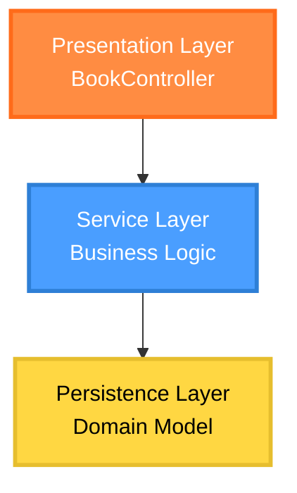
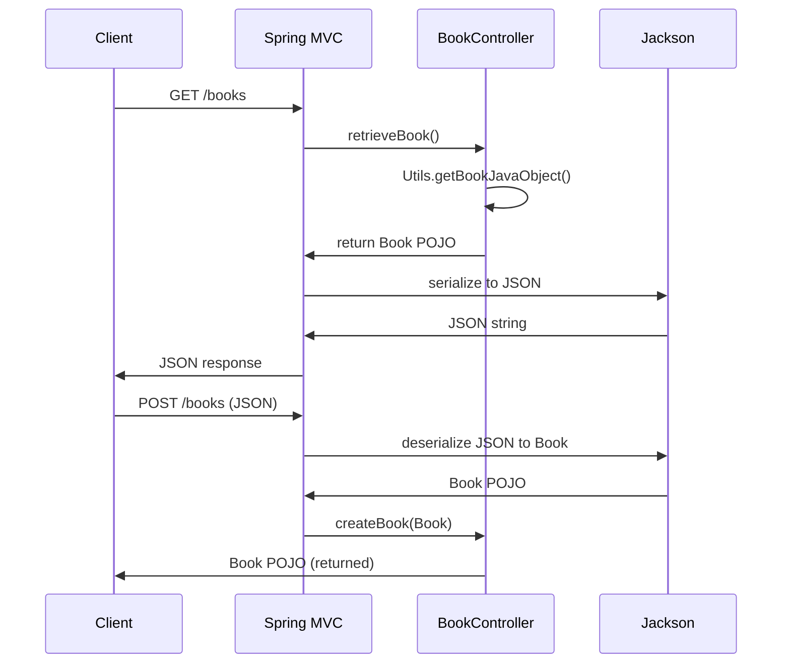

# Java Jackson Demo Project - Deep Analysis

## Project Overview

This project demonstrates the integration of Jackson JSON processor with Spring Boot for handling JSON serialization and deserialization. It showcases automatic conversion between Java objects and JSON through REST endpoints, with emphasis on Jackson annotations for custom mapping and behavioral configurations.

The application serves as a minimal service for managing book entities, exposing GET and POST endpoints that leverage Spring Boot's built-in Jackson integration.

## Architecture and Dependencies

### Three-Layer Architecture

## Jackson Configuration

**Logic Flow**: Spring Boot auto-configures Jackson with sensible defaults, but custom beans override auto-config for customization.

### Custom ObjectMapper Bean 
This project includes a custom [ObjectMapper](src/main/java/com/spring/json/config/JacksonConfig.java) bean to demonstrate advanced configuration (`JacksonConfig.java`).
- Allows fine-tuning of JSON processing behavior
- Enables centralized configuration of serialization/deserialization rules
- Can be injected as a Spring bean for programmatic JSON handling
- `@Configuration` marks this as a Spring configuration class

## Key Components:
- **`@RestController`**: Combines `@Controller` and `@ResponseBody` - all methods return JSON
- **`@Log`**: Lombok logging via `java.util.logging`
- **`@JsonIgnoreProperties(ignoreUnknown = true)`**: **Critical configuration** - Tells Jackson to ignore unknown JSON properties instead of throwing `UnrecognizedPropertyException`. Without this, deserialization would fail if JSON contains extra fields like "foo": "bar".
- **`@JsonProperty("year")`**: Maps JSON field "year" to Java property `yearPublished`, enabling different naming conventions between JSON contract and internal Java naming.

## Controller Layer

### API Design

#### API Endpoints:
| Method | Endpoint | Description                                           |
|--------|----------|-------------------------------------------------------|
| GET    | /books   | Returns JSON representation of a book object          |
| POST   | /books   | Accepts JSON payload and returns the same book object |

#### Logic Details:
- **Automatic JSON Conversion**: Spring MVC uses `MappingJackson2HttpMessageConverter` to automatically convert between Java objects and JSON. No explicit JSON manipulation code needed.
- **GET Method**: Returns a `Book` POJO - Spring Boot serializes it to JSON using Jackson.
- **POST Method**: 
  - Accepts `@RequestBody Book book` - Jackson deserializes incoming JSON to `Book` object
  - `@NotNull` ensures non-null validation
  - Logs the received book for debugging
  - Returns the same object (echoes back), which Jackson serializes to JSON response

#### Flow Diagram:

## Testing with Jackson

### [Utils](src/main/java/com/spring/json/utils/Utils.java) - Sample Data Creation

### Comprehensive Test Coverage (`JacksonTests.java`)

#### Test 1: `testObjectMapperCanCreateJsonFromJavaObject()`

- Verifies Java-to-JSON serialization produces expected JSON.
- Obtains sample book via `Utils.getBookJavaObject()`
- Uses injected `ObjectMapper` to serialize to JSON string
- Asserts exact JSON match including field order and formatting
- Demonstrates that `@JsonProperty` correctly maps `yearPublished` → "year"

#### Test 2: `testObjectMapperCanCreateJavaObjectFromJson()`
 
- Validates JSON-to-Java deserialization creates equivalent objects.
- Hardcoded JSON string matches expected format
- `objectMapper.readValue(json, Book.class)` deserializes to Book object
- Compares deserialized result with utility-generated book
- Ensures `@JsonProperty` mapping works bidirectionally

#### Test 3: `testObjectMapperCanCreateJavaObjectFromJsonWithIgnore()`
- Tests handling of unknown JSON properties.
- JSON includes unknown field "foo": "bar"
- Without `@JsonIgnoreProperties(ignoreUnknown = true)`, this would throw exception
- With the annotation, Jackson ignores unknown fields and deserializes successfully

