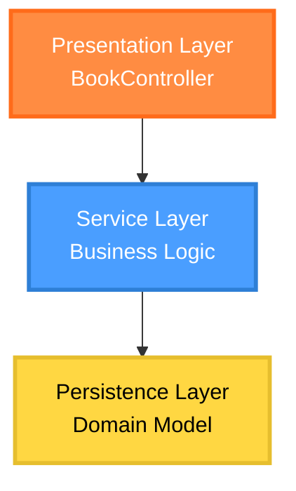
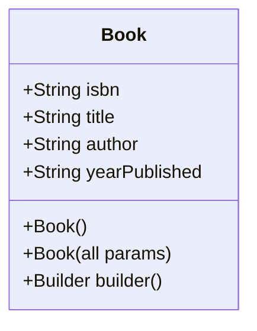
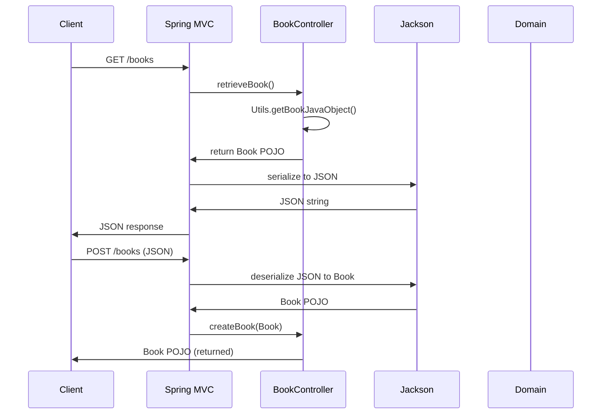

# Java Jackson Demo Project - Deep Analysis

## Project Overview

This project demonstrates the integration of Jackson JSON processor with Spring Boot 3.5.6 for handling JSON serialization and deserialization. It showcases automatic conversion between Java objects and JSON through REST endpoints, with emphasis on Jackson annotations for custom mapping and behavioral configurations.

The application serves as a minimal service for managing book entities, exposing GET and POST endpoints that leverage Spring Boot's built-in Jackson integration.

## Architecture and Dependencies

### Three-Layer Architecture



### Key Dependencies (Extracted from pom.xml)
- **Spring Boot Starter Web (3.5.6)**: Provides web framework and embedded Tomcat
- **Lombok**: Reduces boilerplate code with annotations like `@Data`, `@Builder`
- **Jackson Databind**: Auto-included via Spring Boot for JSON processing
- **Spring Boot Starter Test**: Testing framework with JUnit 5
- **JetBrains Annotations**: Enhanced null-safety and parameter validation

Java version: 25 (Preview)

## Jackson Configuration

### Custom ObjectMapper Bean (`JacksonConfig.java`)
The configuration defines a custom `ObjectMapper` bean, which:
- Allows fine-tuning of JSON processing behavior
- Enables centralized configuration of serialization/deserialization rules
- Can be injected as a Spring bean for programmatic JSON handling
- `@Configuration` marks this as a Spring configuration class

**Logic Flow**: Spring Boot auto-configures Jackson with sensible defaults, but custom beans override auto-config for customization.

## Domain Model Analysis

### Book.java - Complete Annotation Breakdown



#### Key Annotations:
- **`@Data` (Lombok)**: Generates getters, setters, `equals()`, `hashCode()`, `toString()`
- **`@AllArgsConstructor` (Lombok)**: Creates constructor for all fields
- **`@NoArgsConstructor` (Lombok)**: Creates no-args constructor (required for Jackson deserialization)
- **`@Builder` (Lombok)**: Provides fluent builder pattern API
- **`@JsonIgnoreProperties(ignoreUnknown = true)`**: **Critical configuration** - Tells Jackson to ignore unknown JSON properties instead of throwing `UnrecognizedPropertyException`. Without this, deserialization would fail if JSON contains extra fields like "foo": "bar".

#### Field-Level Properties:
- **`@JsonProperty("year")`**: Maps JSON field "year" to Java property `yearPublished`, enabling different naming conventions between JSON contract and internal Java naming.

#### Nuances:
- Lombok and Jackson work together seamlessly: Lombok generates the required constructor and getters/setters that Jackson uses via reflection.
- The builder pattern allows fluent creation: `Book.builder().isbn("...").title("...").build()`

## Controller Layer

### BookController.java - API Design

#### Endpoints:
| Method | Endpoint | Description |
|--------|----------|-------------|
| GET    | /books   | Returns JSON representation of a book object |
| POST   | /books   | Accepts JSON payload and returns the same book object |

#### Logic Details:
- **Automatic JSON Conversion**: Spring MVC uses `MappingJackson2HttpMessageConverter` to automatically convert between Java objects and JSON. No explicit JSON manipulation code needed.
- **GET Method**: Returns a `Book` POJO - Spring Boot serializes it to JSON using Jackson.
- **POST Method**: 
  - Accepts `@RequestBody Book book` - Jackson deserializes incoming JSON to `Book` object
  - `@NotNull` ensures non-null validation
  - Logs the received book for debugging
  - Returns the same object (echoes back), which Jackson serializes to JSON response

#### Annotations:
- **`@RestController`**: Combines `@Controller` and `@ResponseBody` - all methods return JSON
- **`@Log`**: Lombok logging via `java.util.logging`

#### Flow Diagram:


## Utility Classes

### Utils.java - Sample Data Creation

**Purpose**: Provides static method to create sample `Book` instances using the builder pattern.

**Implementation Details**:
- Uses Lombok `@Builder` to construct objects fluently
- Returns hardcoded book data for demonstration
- Serves as utility for controllers and tests

## Testing with Jackson

### Comprehensive Test Coverage (`JacksonTests.java`)

#### Test 1: `testObjectMapperCanCreateJsonFromJavaObject()`
**Purpose**: Verifies Java-to-JSON serialization produces expected JSON.

**Logic**:
- Obtains sample book via `Utils.getBookJavaObject()`
- Uses injected `ObjectMapper` to serialize to JSON string
- Asserts exact JSON match including field order and formatting
- Demonstrates that `@JsonProperty` correctly maps `yearPublished` → "year"

**Key Assertion**: `result.equals(expectedJsonString)` - Checks complete JSON structure

#### Test 2: `testObjectMapperCanCreateJavaObjectFromJson()`
**Purpose**: Validates JSON-to-Java deserialization creates equivalent objects.

**Logic**:
- Hardcoded JSON string matches expected format
- `objectMapper.readValue(json, Book.class)` deserializes to Book object
- Compares deserialized result with utility-generated book
- Ensures `@JsonProperty` mapping works bidirectionally

**Nuance**: Relies on Lombok-generated `equals()` for object comparison

#### Test 3: `testObjectMapperCanCreateJavaObjectFromJsonWithIgnore()`
**Purpose**: Tests handling of unknown JSON properties.

**Logic**:
- JSON includes unknown field "foo": "bar"
- Without `@JsonIgnoreProperties(ignoreUnknown = true)`, this would throw exception
- With the annotation, Jackson ignores unknown fields and deserializes successfully
- Compares result equals original book object

**Critical Demonstration**: Shows robustness of API against schema evolution (adding new JSON fields)

### Test Configuration:
- `@SpringBootTest`: Loads full application context including custom `ObjectMapper`
- `@Autowired ObjectMapper`: Injects configured Jackson instance
- All tests use JUnit 5, but assertions use plain `assert()` - functionally correct but not idiomatic (should use `Assertions.assertEquals()`)

## Data Examples

### Sample JSON Output/Input:
```json
{
  "isbn": "9780-lkw8-4785",
  "title": "Land of seven rivers",
  "author": "Sanjeev Sanyal",
  "year": "2012"
}
```

**Note**: JSON field "year" maps to Java `yearPublished` due to `@JsonProperty` annotation.

## API Endpoints

### Books Resource
As demonstrated in code, endpoints follow REST conventions:

| Method | Endpoint | Function              |
|--------|----------|-----------------------|
| GET    | /books   | Retrieve book data    |
| POST   | /books   | Create/echo book data |

### Authors and Books Resources (Referenced)
While only books endpoints are implemented, the existing README templates):

#### Authors
| Method | Endpoint      |
|--------|---------------|
| POST   | /authors      |
| GET    | /authors/{id} |
| GET    | /authors      |
| PUT    | /authors/{id} |
| PATCH  | /authors/{id} |
| DELETE | /authors/{id} |

#### Books
| Method | Endpoint      |
|--------|---------------|
| PUT    | /books/{isbn} |
| GET    | /books/{isbn} |
| GET    | /books        |
| PUT    | /books/{isbn} |
| PATCH  | /books/{isbn} |
| DELETE | /books/{isbn} |

## Configuration Files

### application.properties
Minimal Spring Boot configuration:
```
spring.application.name=jackson demo
```

Establishes application name for logging and monitoring.

## Key Learnings & Best Practices

1. **Jackson Auto-Configuration**: Spring Boot handles most setup automatically
2. **Annotation Strategy**: `@JsonIgnoreProperties(ignoreUnknown = true)` for version-tolerant APIs
3. **Lombok Integration**: Seamless combination for reducing boilerplate
4. **Custom ObjectMapper**: For advanced serialization needs
5. **Testing Importance**: Comprehensive tests cover serialization, deserialization, and edge cases
6. **API Design**: Consistent JSON field naming via `@JsonProperty`

## Next Chapter Considerations

Building on this foundation, future enhancements could include:
- Full CRUD operations for books
- Database integration (as in 4_jpa module)
- Validation annotations (@NotBlank, @Size)
- Custom serializers/deserializers
- Error handling with Jackson exceptions
