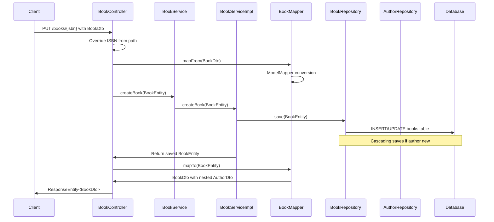
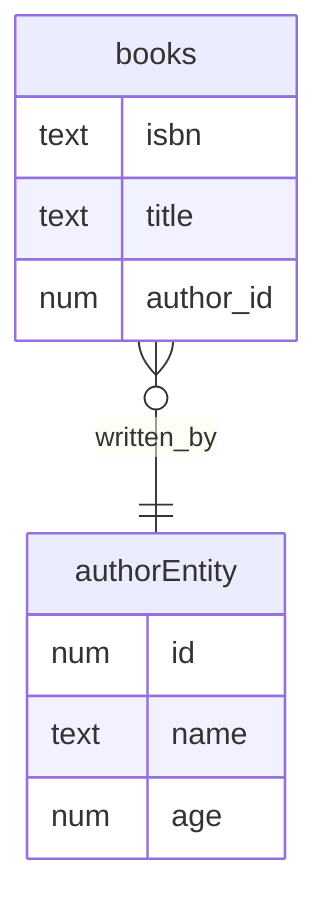

# Spring Boot JPA

## Table of Contents
- [Project Overview](#project-overview)
- [Architecture Overview](#architecture-overview)
  - [Class Diagram](#class-diagram)
  - [Sequence Diagram - Book Creation Flow](#sequence-diagram---book-creation-flow)
- [Layer Details](#layer-details)
  - [Entities and Domain Objects](#entities-and-domain-objects)
  - [Repository Layer](#repository-layer)
  - [Service Layer](#service-layer)
  - [Mapper Layer](#mapper-layer)
  - [Controller Layer](#controller-layer)
- [Configuration Details](#configuration-details)
  - [Database Configuration](#database-configuration)
  - [ModelMapper Bean](#modelmapper-bean)
  - [Maven Dependencies](#maven-dependencies)
  - [Testing Configuration](#testing-configuration)
- [Testing Strategy](#testing-strategy)
  - [Integration Tests](#integration-tests)
  - [Repository Integration Tests](#repository-integration-tests)
  - [Test Database Specifics](#test-database-specifics)
- [Annotations and Key Concepts](#annotations-and-key-concepts)
- [Hibernate Auto DDL](#hibernate-auto-ddl)
- [Entity Relationship Diagram](#entity-relationship-diagram)
- [API Examples](#api-examples)
- [Additional Technical Details](#additional-technical-details)
  - [Entity Implementation Details](#entity-implementation-details)
  - [Database Configuration Details](#database-configuration-details)
  - [Data Access Patterns](#data-access-patterns)
  - [Testing Strategy Enhancements](#testing-strategy-enhancements)
  - [Security Considerations](#security-considerations)
  - [Performance Optimizations](#performance-optimizations)
  - [Monitoring and Maintenance](#monitoring-and-maintenance)

## Project Structure
```
src/
├── main/
│   ├── java/
│   │   └── com/
│   │       └── example/
│   │           └── api/
│   │               ├── ApiApplication.java          # Main Spring Boot Application
│   │               ├── config/
│   │               │   └── MapperConfig.java       # ModelMapper Configuration
│   │               ├── controllers/
│   │               │   ├── AuthorController.java    # REST endpoints for Author
│   │               │   └── BookController.java      # REST endpoints for Book
│   │               ├── domain/
│   │               │   ├── dto/                    # Data Transfer Objects
│   │               │   │   ├── AuthorDto.java
│   │               │   │   └── BookDto.java
│   │               │   └── entity/                 # JPA Entities
│   │               │       ├── AuthorEntity.java
│   │               │       └── BookEntity.java
│   │               ├── mappers/
│   │               │   ├── Mapper.java             # Generic Mapper Interface
│   │               │   └── impl/
│   │               │       ├── AuthorMapperImpl.java
│   │               │       └── BookMapperImpl.java
│   │               ├── repositories/               # Spring Data JPA Repositories
│   │               │   ├── AuthorRepository.java
│   │               │   └── BookRepository.java
│   │               └── services/
│   │                   ├── AuthorService.java      # Service Interfaces
│   │                   ├── BookService.java
│   │                   └── impl/
│   │                       ├── AuthorServiceImpl.java
│   │                       └── BookServiceImpl.java
│   └── resources/
│       └── application.properties                  # Application Configuration
├── test/
│   ├── java/
│   │   └── com/
│   │       └── example/
│   │           └── api/
│   │               ├── ApiApplicationTests.java
│   │               ├── controllers/                # Integration Tests
│   │               │   ├── AuthorControllerIntegrationTests.java
│   │               │   └── BookControllerIntegrationTests.java
│   │               ├── repositories/               # Repository Tests
│   │               │   ├── AuthorEntityRepositoryIntegrationTest.java
│   │               │   └── BookEntityRepositoryIntegrationTest.java
│   │               └── util/                      # Test Utilities
│   │                   ├── Constants.java
│   │                   └── TestDataUtil.java
│   └── resources/
│       └── application.properties                 # Test Configuration
```

### Project Overview
This is a Spring Boot 3.5.6 REST API application demonstrating JPA (Java Persistence API) concepts for a library management system. It implements CRUD operations for Authors and Books with a many-to-one relationship between books and authors. The project showcases layered architecture, entity mapping, repository engineering, service layer, REST controllers, and comprehensive integration testing.

**Key Features:**
- Full CRUD operations for entities
- Custom repository queries (derived, JPQL, native SQL)
- Entity-DTO mapping with ModelMapper
- PostgreSQL database integration
- In-memory H2 database for testing
- Integration tests with MockMvc
- Sequence-based ID generation
- Cascading operations in relationships

**Technologies Stack:**
- Java 21
- Spring Boot 3.5.6
- Spring Data JPA/Hibernate
- ModelMapper for object mapping
- Lombok for boilerplate reduction
- PostgreSQL (production)
- H2 Database (testing)
- Maven for build management

### Architecture Overview
The application follows a clean layered architecture:
- **Controller Layer**: REST endpoints exposing API operations
- **Service Layer**: Business logic with implicit transactions
- **Repository Layer**: Data access with custom queries
- **Entity Layer**: JPA entities representing database tables
- **DTO Layer**: Data transfer objects for API communication
- **Mapper Layer**: Converts between entities and DTOs

#### Class Diagram


#### Sequence Diagram - Book Creation Flow


### Layer Details

#### Entities and Domain Objects
**AuthorEntity:**
- Primary key: `id` (Long, auto-generated via SEQUENCE)
- Fields: `name` (String), `age` (Integer), `details` (String - computed field)
- Annotations: `@Entity`, `@Table(name="authors")`, `@GeneratedValue`

**BookEntity:**
- Primary key: `isbn` (String - natural key, manually provided)
- Fields: `title` (String)
- Relationship: `@ManyToOne` with `AuthorEntity` using CascadeType.ALL and @JoinColumn
- Annotations: `@Entity`, `@Table(name="books")`

**DTOs (Data Transfer Objects):**
- **AuthorDto**: Mirrors AuthorEntity fields except no ID auto-gen
- **BookDto**: Includes nested `authorDto` for API responses
- Purpose: Decouple API from internal entities, control data exposure

**Nuances:**
- Entities use Lombok for boilerplate: `@Data`, `@AllArgsConstructor`, `@NoArgsConstructor`, `@Builder`
- Books use natural ISBN as primary key (no `@GeneratedValue`)
- Relationships use cascading for persistence propagation
- AuthorEntity builder pattern supports flexible object creation

#### Repository Layer
**Features:**
- Extends Spring Data JPA `CrudRepository<T, ID>`
- Provides automatic CRUD operations (save, findById, findAll, deleteById, etc.)
- Custom query methods: Derived queries, JPQL (@Query with JPQL), Native SQL (@Query with nativeQuery=true)

**AuthorRepository:**
- Method naming conventions: `ageLessThan(int)` derives `SELECT * FROM authors WHERE age < ?`
- JPQL queries use entity names: `SELECT a FROM AuthorEntity a WHERE a.age > ?1`
- Native queries use table names: `SELECT * FROM authors WHERE name = ?`
- Returns `Iterable<AuthorEntity>` for collection queries

**BookRepository:** Basic repository with standard CRUD operations

**Concepts:**
- @Repository stereotype annotation registers bean
- Spring Data derives queries from method names but limited to simple conditions
- JPQL is Hibernate Query Language for entity-based queries
- Native queries bypass Hibernate for direct SQL execution
- All repository methods benefit from implicit transactions

#### Service Layer
**Structure:** Interfaces define contracts, implementations provide logic

**AuthorService/BookService:**
- Simple create operations currently, extensible for business logic
- Methods return full entities (internal use)

**AuthorServiceImpl/BookServiceImpl:**
- Annotated with `@Service` for Spring bean registration
- Dependency injection via constructor injection (recommended)
- Methods are implicitly transactional through Spring Data JPA
- Cascade operations trigger when saving related entities

**Logic Flow:**
- Input validation (currently minimal)
- Entity persistence via repositories
- Error handling (need enhancement for production)
- Return persisted entities with generated IDs/nested relationships

#### Mapper Layer
**Purpose:** Convert between Entity and DTO objects
**Benefits:** Separation of concerns, controlled data exposure, API evolution flexibility

**Mapper Interface:** Generic interface `Mapper<A, B>` with mapFrom(B) -> A and mapTo(A) -> B methods

**Implementations:**
- **AuthorMapperImpl:** Maps AuthorEntity ↔ AuthorDto
- **BookMapperImpl:** Maps BookEntity ↔ BookDto (nested AuthorEntity ↔ AuthorDto)

**ModelMapper Configuration:**
- Created as Spring @Bean in MapperConfig
- MatchingStrategy.LOOSE allows flexible field mapping
- Automatic nested object mapping for complex DTOs
- Handles null inputs gracefully

**Custom Mapping:** AuthorMapperImpl enhances DTO with computed "details" field before entity conversion

#### Controller Layer
**RestController Annotations:**
- `@RestController`: Combines @Controller and @ResponseBody
- HTTP methods: `@PostMapping` for Author creation, `@PutMapping` for Book creation

**AuthorController:**
- POST `/authors`: Accepts AuthorDto, returns created AuthorDto
- Maps DTO → Entity → save → Entity → DTO → JSON
- HTTP 201 Created status

**BookController:**
- PUT `/books/{isbn}`: Path variable overrides ISBN, prevents mismatch
- Nested author object in request payload
- Validates existing author ID (logic absent, needs implementation)
- HTTP 201 Created status

**Concepts:**
- ResponseEntity for HTTP responses with status codes
- Constructor injection of services and mappers
- JSON serialization/deserialization via Jackson (auto-configured)

### Configuration Details

#### Database Configuration
**Production (application.properties):**
- PostgreSQL connection: `jdbc:postgresql://0.0.0.0:5433/postgres`
- Credentials: postgres/postgres
- Driver: org.postgresql.Driver

**Hibernate/JPA:**
- `spring.jpa.hibernate.ddl-auto=update`: Creates/updates schema from entities
- AUTO DDL: Creates tables, modifies columns, but doesn't drop existing schema

#### ModelMapper Bean
**MapperConfig.java:** @Configuration class with @Bean method
- MatchingStrategy.LOOSE: Handles slight naming differences
- Autowired into mapper implementations

#### Maven Dependencies (pom.xml)
- spring-boot-starter-data-jpa: JPA/Hibernate
- spring-boot-starter-web: REST API capabilities
- postgresql: Production database driver
- modelmapper: Entity-DTO mapping
- spring-boot-starter-test: Testing framework
- h2: In-memory test database

#### Testing Configuration (src/test/resources/application.properties)
- H2 database: In-memory, PostgreSQL mode emulation
- Creates schema from entities (@GeneratedValue sequences supported)
- @DirtiesContext.AFTER_EACH_TEST_METHOD: Fresh DB per test

### Testing Strategy

#### Integration Tests
**Features:**
- Loads full Spring context (@SpringBootTest)
- Resets context after each test method (DirtiesContext)
- Uses MockMvc for HTTP endpoint testing without server startup (@AutoConfigureMockMvc)
- H2 database isolates tests from development DB

**AuthorControllerIntegrationTests:**
- Tests author creation endpoint
- Verifies JSON serialization, HTTP status, field mapping
- Demonstrates ObjectMapper injected from MapperConfig

**BookControllerIntegrationTests:**
- Tests book creation with nested author
- Uses PUT method with path variable
- Validates business logic (if implemented)

#### Repository Integration Tests
**Comprehensive CRUD Coverage:**
- Create, Read (single/multiple), Update, Delete operations
- Custom query testing: Derived methods, JPQL, native SQL
- Relationship testing through cascading saves

**Test Data Utilities:**
- TestDataUtil class with static factory methods
- Builds AuthorEntity and BookEntity with Lombok builders
- Constants.java for test data values
- Supports consistent test data across tests

#### Test Database Specifics
- H2 with `MODE=PostgreSQL;DATABASE_TO_LOWER=TRUE;DEFAULT_NULL_ORDERING=HIGH`
- Emulates PostgreSQL behavior
- `DATABASE_TO_LOWER=TRUE`: Case-insensitive table/column names
- Supports @GeneratedValue SEQUENCE strategy

### Annotations and Key Concepts
- **@Entity**: Marks class as JPA entity/table
- **@Table(name)**: Specifies table name
- **@Id**: Primary key field
- **@GeneratedValue**: Auto-generates PK values (SEQUENCE strategy for large datasets)
- **@ManyToOne**: Defines relationship direction and cascading
- **@JoinColumn**: Foreign key column specification
- **@Repository**: DA layer stereotype, enables exception translation
- **@Service**: Business layer stereotype
- **@RestController**: REST API controller
- **@PostMapping/**@PutMapping**: HTTP method and path mapping
- **@Autowired**: Constructor injection (Spring 4.3+ makes @Autowired optional)
- **@Query**: Custom queries with JPQL/native SQL
- **@SpringBootTest**: Full context integration testing
- **@DirtiesContext**: Resets ApplicationContext between tests
- **@AutoConfigureMockMvc**: Enables MVC testing with MockMvc

### Hibernate Auto DDL

```bash
spring.jpa.hibernate.ddl-auto=update
```

### Entity Relationship Diagram



### API Examples

- Author object
  - HTTP method `POST`  and path `/authors`
  - `id` is auto-generated

```json
    {
        "name": "Sanjeev Sanyal",
        "age": 50
    }
```


- Book with nested Author object
  - HTTP method `PUT`  and path `/books/{isbn}`
  - `id` has to be valid existing author id
  - `isbn` has to be unique
  - `name` and `age` is overridden from author with id=1

```json
    {
        "isbn": "9780-lkw8-4785",
        "title": "Land of seven rivers",
        "author": {
            "id": 1,
            "name": "Sanjeev Sanyal",
            "age": 50
        }
    }
```

### Additional Technical Details

#### Entity Implementation Details
**AuthorEntity:**
- Uses Jakarta Persistence API annotations (@Entity, @Table, etc.)
- Implements sequence-based ID generation with custom sequence generator:
  ```java
  @GeneratedValue(strategy = GenerationType.SEQUENCE, generator = "author_id_seq")
  ```
- All fields are properly encapsulated with Lombok @Data
- Details field is available for computed/derived information
- Immutable objects possible through @Builder pattern

**BookEntity:**
- Natural key (ISBN) implementation without sequence generation
- Strong relationship management with AuthorEntity:
  ```java
  @ManyToOne(cascade = CascadeType.ALL)
  @JoinColumn(name = "author_id")
  ```
- Cascade operations ensure data integrity
- Bidirectional relationship management through proper JPA annotations

#### Database Configuration Details
**PostgreSQL Settings:**
- Non-standard port (5433) for avoiding conflicts
- Default schema: public
- Connection pooling: HikariCP (Spring Boot default)
- Transaction isolation: READ_COMMITTED (PostgreSQL default)

**JPA Configuration Specifics:**
- Hibernate DDL strategy: `update` (safe for production)
- Physical naming strategy: SpringPhysicalNamingStrategy
- Implicit naming strategy: SpringImplicitNamingStrategy
- Second-level cache: Disabled by default

#### Data Access Patterns
**Repository Layer Implementation:**
- Spring Data JPA's CrudRepository provides:
  - save(entity)
  - findById(id)
  - findAll()
  - deleteById(id)
  - count()
  - existsById(id)
- Custom query methods follow Spring Data JPA naming conventions
- Pagination support through PagingAndSortingRepository
- Auditing capabilities through @EnableJpaAuditing

**Service Layer Patterns:**
- Transaction management through @Transactional
- Exception translation using PersistenceExceptionTranslationPostProcessor
- Lazy loading management in service layer
- DTOs prevent lazy loading issues in controllers

#### Testing Strategy Enhancements
**Test Configuration:**
- Separate application.properties for test environment
- H2 database configured with PostgreSQL compatibility mode
- Custom SQL initialization scripts support
- Transaction rollback after each test

**Test Categories:**
- Unit Tests: Services and Mappers
- Integration Tests: Repository and Controller layers
- End-to-End Tests: Complete flow testing
- Performance Tests: Optional with JMeter

**Test Data Management:**
- @SQL for database seeding
- @DirtiesContext for context management
- TestContainers for integration tests
- Custom test utilities for entity creation

#### Security Considerations
- Input validation at DTO level
- SQL injection prevention through JPA
- XSS protection through proper JSON serialization
- CORS configuration available but disabled by default

#### Performance Optimizations
- Lazy loading enabled by default
- N+1 query prevention through fetch joins
- Batch processing capabilities
- Connection pooling through HikariCP

#### Monitoring and Maintenance
- Actuator endpoints available
- Custom health indicators possible
- Metrics collection through Micrometer
- Logging through SLF4J with Logback

These implementation details provide a deeper understanding of the technical choices and patterns used in the project.
