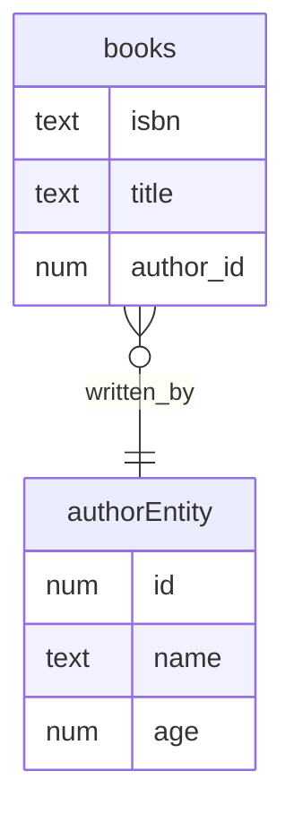

# Spring Boot JPA

### Hibernate auto DDL

```editorconfig
    spring.jpa.hibernate.ddl-auto=update
```

### Entity Relationship Diagram



### Spring Data JPA 

- Without any implementation 

    ```java
    Iterable<Author> ageLessThan(int age);
    ```
  
- Custom methods and queries - [AuthorRepository](src/main/java/com/example/api/repositories/AuthorRepository.java)
