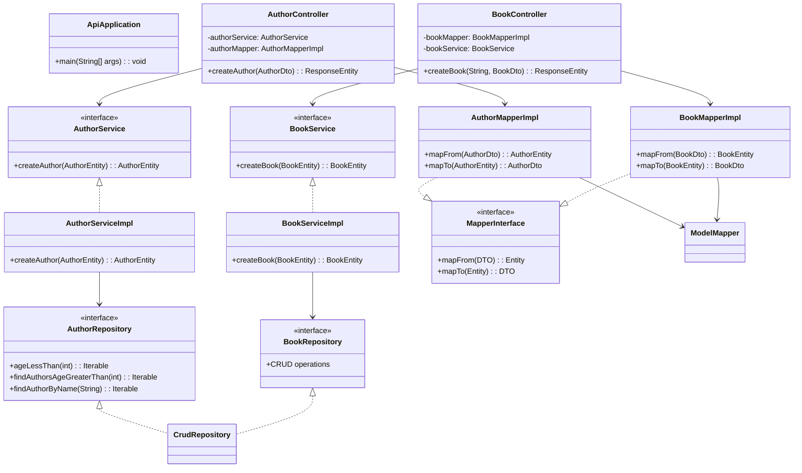
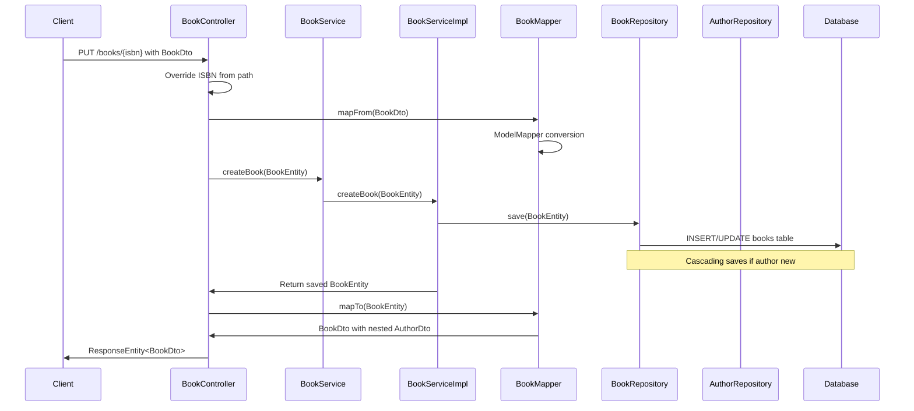

# Spring Boot JPA

## Table of Contents
- [Project Structure](#project-structure)
- [Project Overview](#project-overview)
- [Architecture Overview](#architecture-overview)
  - [Class Diagram](#class-diagram)
  - [Sequence Diagram - Book Creation Flow](#sequence-diagram---book-creation-flow)
- [Layer Details](#layer-details)
  - [Entities and Domain Objects](#entities-and-domain-objects)
  - [Repository Layer](#repository-layer)
  - [Service Layer](#service-layer)
  - [Mapper Layer](#mapper-layer)
  - [Presentation (Controller) Layer](#presentation-controller-layer)
- [Testing Strategy](#testing-strategy)
  - [Integration Tests](#integration-tests)
  - [Repository Integration Tests](#repository-integration-tests)
- [API Examples](#api-examples)
  - [Authors](#authors)
  - [Books](#books)
  - [Sample Requests](#sample-requests)
- [Database Configuration](#database-configuration)

### Project Structure
```
src/
├── main/
│   ├── java/
│   │   └── com/
│   │       └── example/
│   │           └── api/
│   │               ├── ApiApplication.java          # Main Spring Boot Application
│   │               ├── config/
│   │               │   └── MapperConfig.java       # ModelMapper Configuration
│   │               ├── controllers/
│   │               │   ├── AuthorController.java    # REST endpoints for Author
│   │               │   └── BookController.java      # REST endpoints for Book
│   │               ├── domain/
│   │               │   ├── dto/                    # Data Transfer Objects
│   │               │   │   ├── AuthorDto.java
│   │               │   │   └── BookDto.java
│   │               │   └── entity/                 # JPA Entities
│   │               │       ├── AuthorEntity.java
│   │               │       └── BookEntity.java
│   │               ├── mappers/
│   │               │   ├── Mapper.java             # Generic Mapper Interface
│   │               │   └── impl/
│   │               │       ├── AuthorMapperImpl.java
│   │               │       └── BookMapperImpl.java
│   │               ├── repositories/               # Spring Data JPA Repositories
│   │               │   ├── AuthorRepository.java
│   │               │   └── BookRepository.java
│   │               └── services/
│   │                   ├── AuthorService.java      # Service Interfaces
│   │                   ├── BookService.java
│   │                   └── impl/
│   │                       ├── AuthorServiceImpl.java
│   │                       └── BookServiceImpl.java
│   └── resources/
│       └── application.properties                  # Application Configuration
├── test/
│   ├── java/
│   │   └── com/
│   │       └── example/
│   │           └── api/
│   │               ├── ApiApplicationTests.java
│   │               ├── controllers/                # Integration Tests
│   │               │   ├── AuthorControllerIntegrationTests.java
│   │               │   └── BookControllerIntegrationTests.java
│   │               ├── repositories/               # Repository Tests
│   │               │   ├── AuthorEntityRepositoryIntegrationTest.java
│   │               │   └── BookEntityRepositoryIntegrationTest.java
│   │               └── util/                      # Test Utilities
│   │                   ├── Constants.java
│   │                   └── TestDataUtil.java
│   └── resources/
│       └── application.properties                 # Test Configuration
```

### Project Overview

**Key Features:**
- Full CRUD operations for entities
- Custom repository queries (derived, JPQL, native SQL)
- Entity-DTO mapping with ModelMapper
- PostgreSQL database integration
- In-memory H2 database for testing
- Integration tests with MockMvc
- Sequence-based ID generation
- Cascading operations in relationships

### Architecture Overview
The application follows a clean layered architecture:
- **Presentation Layer**: Controller with REST endpoints exposing API operations
- **Service Layer**: Business logic with implicit transactions
- **Repository Layer**: Data access with custom queries
- **Entity Layer**: JPA entities representing database tables
- **DTO Layer**: Data transfer objects for API communication
- **Mapper Layer**: Converts between entities and DTOs

#### Class Diagram


#### Sequence Diagram - Book Creation Flow


### Layer Details

#### Entities and Domain Objects
**AuthorEntity:**
- Primary key: `id` (Long, auto-generated via SEQUENCE)
- Fields: `name` (String), `age` (Integer), `details` (String - computed field)
- Annotations: `@Entity`, `@Table(name="authors")`, `@GeneratedValue`

**BookEntity:**
- Primary key: `isbn` (String - natural key, manually provided)
- Fields: `title` (String)
- Relationship: `@ManyToOne` with `AuthorEntity` using `CascadeType.ALL` and `@JoinColumn`
- Annotations: `@Entity`, `@Table(name="books")`

**DTOs (Data Transfer Objects):**
- **AuthorDto**: Mirrors AuthorEntity fields except no ID auto-gen
- **BookDto**: Includes nested `authorDto` for API responses
- Purpose: Decouple API from internal entities, control data exposure

#### Repository Layer
**Features:**
- Extends Spring Data JPA `CrudRepository<T, ID>`
- Provides automatic CRUD operations:
  - `save(entity)`: Insert or update entity
  - `findById(id)`: Retrieve by ID
  - `findAll()`: Get all entities
  - `deleteById(id)`: Remove by ID
  - `count()`: Count total entities
  - `existsById(id)`: Check existence
- Custom query methods: Derived queries, JPQL (@Query with JPQL), Native SQL (@Query with nativeQuery=true)

**AuthorRepository:**
- Supports basic repository with standard CRUD operations
- Returns `Iterable<AuthorEntity>` for collection queries
- Custom query methods
  - Method naming conventions: `ageLessThan(int)` derives `SELECT * FROM authors WHERE age < ?`
  - JPQL queries use entity names: `SELECT a FROM AuthorEntity a WHERE a.age > ?1`
  - Native queries use table names: `SELECT * FROM authors WHERE name = ?`


**BookRepository:**
- Supports basic repository with standard CRUD operations


#### Service Layer

**AuthorService/BookService:**
- Simple create operations currently, extensible for business logic

**AuthorServiceImpl/BookServiceImpl:**
- Annotated with `@Service` for Spring bean registration
- Dependency injection via constructor injection (recommended)
- Methods are implicitly transactional through Spring Data JPA
- Cascade operations trigger when saving related entities

#### Mapper Layer
**Purpose:** Convert between Entity and DTO objects

**Mapper Interface:** Generic interface `Mapper<A, B>` with mapFrom(B) -> A and mapTo(A) -> B methods

**Custom Mapping:** AuthorMapperImpl enhances DTO with computed "details" field before entity conversion

**Implementations:**
- **AuthorMapperImpl:** Maps AuthorEntity ↔ AuthorDto
- **BookMapperImpl:** Maps BookEntity ↔ BookDto (nested AuthorEntity ↔ AuthorDto)

**ModelMapper Configuration:**
- Created as Spring `@Bean` in MapperConfig
- `MatchingStrategy.LOOSE` allows flexible field mapping, ignoring minor name mismatches
  - Skips null fields during mapping to avoid overwriting existing values
  - Supports deep/nested object mapping automatically
- Automatic nested object mapping for complex DTOs
- Handles null inputs gracefully

#### Presentation (Controller) Layer
**RestController Annotations:** `@RestController`: Combines @Controller and @ResponseBody

**AuthorController:**
- POST `/authors`: Accepts AuthorDto, returns created AuthorDto
- Maps DTO → Entity → save → Entity → DTO → JSON
- HTTP 201 Created status

**BookController:**
- PUT `/books/{isbn}`: Path variable overrides ISBN, prevents mismatch
- Nested author object in request payload
- Validates existing author ID (logic absent, needs implementation)
- HTTP 201 Created status

### Testing Strategy

#### Integration Tests
**Features:**
- Loads full Spring context (`@SpringBootTest`)
- Resets context after each test method (`@DirtiesContext`)
- Uses MockMvc for HTTP endpoint testing without server startup (`@AutoConfigureMockMvc`)
- H2 database isolates tests from development DB

**AuthorControllerIntegrationTests:**
- Tests author creation endpoint
- Verifies JSON serialization, HTTP status, field mapping
- Demonstrates ObjectMapper injected from MapperConfig

**BookControllerIntegrationTests:**
- Tests book creation with nested author
- Uses PUT method with path variable
- Validates business logic (if implemented)

#### Repository Integration Tests
**Comprehensive CRUD Coverage:**
- Create, Read (single/multiple), Update, Delete operations
- Custom query testing: Derived methods, JPQL, native SQL
- Relationship testing through cascading saves

### API Examples

#### Authors
| Method | Endpoint      |
|--------|---------------|
| POST   | /authors      |
| GET    | /authors/{id} |
| GET    | /authors      |
| PUT    | /authors/{id} |
| PATCH  | /authors/{id} |
| DELETE | /authors/{id} |

#### Books
| Method | Endpoint      |
|--------|---------------|
| PUT    | /books/{isbn} |
| GET    | /books/{isbn} |
| GET    | /books        |
| PUT    | /books/{isbn} |
| PATCH  | /books/{isbn} |
| DELETE | /books/{isbn} |

#### Sample Requests

- Author object
  - HTTP method `POST`  and path `/authors`
  - `id` is auto-generated

```json
    {
        "name": "Sanjeev Sanyal",
        "age": 50
    }
```


- Book with nested Author object
  - HTTP method `PUT`  and path `/books/{isbn}`
  - `id` has to be valid existing author id
  - `isbn` has to be unique
  - `name` and `age` is overridden from author with id=1

```json
    {
        "isbn": "9780-lkw8-4785",
        "title": "Land of seven rivers",
        "author": {
            "id": 1,
            "name": "Sanjeev Sanyal",
            "age": 50
        }
    }
```

### Database Configuration

**PostgreSQL Settings:**
- Non-standard port (5433) for avoiding conflicts
- Default schema: public
- Connection Pooling: HikariCP (Spring Boot's default high-performance JDBC connection pool)

**Transaction Settings:**
- Transaction Isolation: READ_COMMITTED (PostgreSQL default, balances consistency and performance)

**DDL Strategy:**
- `hibernate.hbm2ddl.auto` set to `update` (safe for production as it only adds/modifies without dropping)
