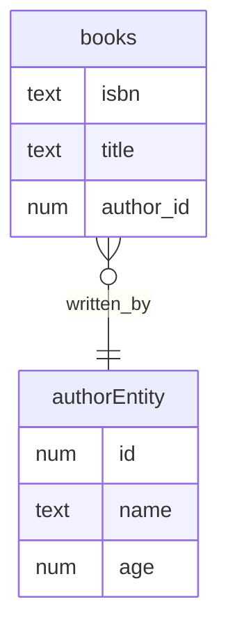

# Spring Boot JPA

### Hibernate auto DDL

```editorconfig
    spring.jpa.hibernate.ddl-auto=update
```

### Entity Relationship Diagram



### API Examples

- Author object
  - HTTP method `POST`  and path `/authors`
  - `id` is auto-generated

```json
    {
        "name": "Sanjeev Sanyal",
        "age": 50
    }
```


- Book with nested Author object
  - HTTP method `PUT`  and path `/books/{isbn}`
  - `id` has to be valid existing author id
  - `isbn` has to be unique
  - `name` and `age` is overridden from author with id=1

```json
    {
        "isbn": "9780-lkw8-4785",
        "title": "Land of seven rivers",
        "author": {
            "id": 1,
            "name": "Sanjeev Sanyal",
            "age": 50
        }
    }
```

