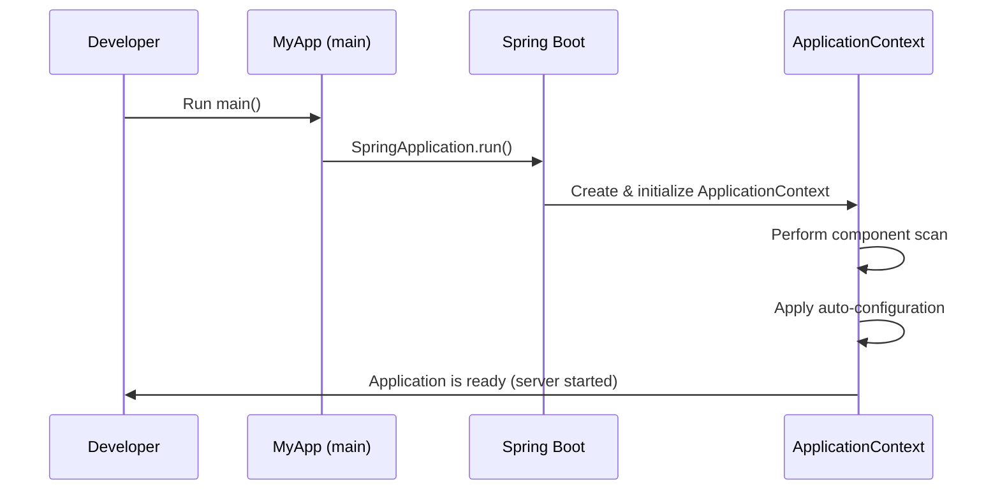
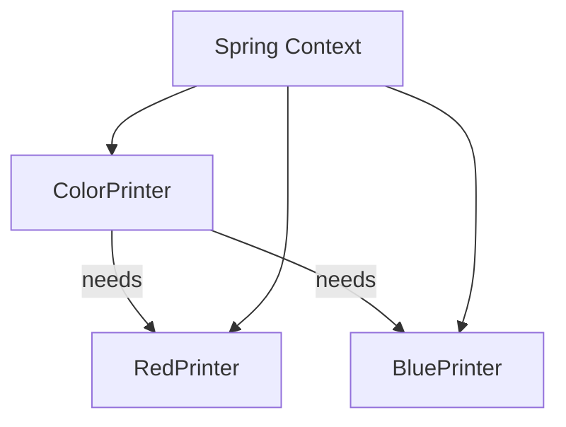

# Spring Boot — Detailed Study Notes (from Beginner Transcript)

## Java Classpath

- In Java, a classpath is a list of directories, JAR (Java Archive) files, and ZIP archives that the Java compiler and Java Virtual Machine (JVM) use to locate class files. It is an essential component for any Java program to be compiled and run correctly.

- **How the classpath works**
  - When a Java program starts, the JVM needs to find and load all the necessary classes, which exist as compiled .class files. The classpath provides the "roadmap" for where the JVM should look to find these files.
  - The classpath is composed of different entries, typically separated by a colon (:) on macOS/Linux and a semicolon (;) on Windows. Each entry tells the JVM a new place to look for classes.
  - `/Users/prasanv/.m2/repository/org/springframework/boot/spring-boot-starter-web/3.5.5/spring-boot-starter-web-3.5.5.jar:/Users/prasanv/.m2/repository/org/springframework/boot/spring-boot-starter/3.5.5/spring-boot-starter-3.5.5.jar`
  - [classpath](classpath.txt)
- **Using a build tools**
  - In modern Java development, build tools like Maven or Gradle manage the classpath for you. They read the dependencies you specify in a configuration file (like pom.xml or build.gradle) and automatically assemble the correct classpath during the build and execution phases.
  - Print classpath on console, using the exec-maven-plugin
    - `mvn -q exec:exec -Dexec.executable="echo" -Dexec.args="%classpath"`
  - View class path as maven dependency tree
    - `mvn dependency:tree`

--- 

## 1. What is Spring Boot vs Spring Framework?

- **Spring Framework** (2003): Powerful but requires a lot of manual XML/Java config. You configure beans, define data sources, set up MVC dispatchers manually. It gives flexibility but also complexity.
- **Spring Boot** (2014): Built on top of Spring Framework that applies convention over configuration. Its main goal is to reduce boilerplate and accelerate development:
  - **Autoconfiguration** → automatically wires components based on classpath (e.g., if H2 DB is present, it auto-configures a datasource).
  - **Starters** → pre-packaged dependencies (e.g., `spring-boot-starter-web` includes Spring MVC, Jackson, Tomcat).
  - **Embedded servers** → run apps without external Tomcat install.
  - **Production-ready features** → health checks, metrics, logging, monitoring via Actuator.
- **Spring Framework**: a comprehensive framework for Java applications. Provides DI container, MVC, JDBC, JPA, transaction management, etc. But it is highly configurable → requires lots of manual setup.

---

## 2. Project Bootstrapping (Spring Initializer)

- [Spring Initialize](https://start.spring.io) is the **quickest way** to create a Spring Boot project.
- Steps:
  1. Fill metadata → Group (like package root), Artifact (project name), Packaging (Jar/War), Java version.
  2. Choose dependencies → e.g., `spring-boot-starter-web` (REST), `spring-boot-starter-data-jpa` (DB).
  3. Download and extract → contains Maven wrapper and pre-set folder structure.
- **Note**: Always keep the main class in root package so that **component scanning** covers the entire project.
- [Maven Directory convention](https://maven.apache.org/guides/introduction/introduction-to-the-standard-directory-layout.html)
  - layout ensures Spring Boot finds what it needs automatically without extra config.
    - `src/main/java` → application code.
    - `src/main/resources` → config files(`application.properties`), static assets, templates.
    - `src/test/java` → test code.
    - `src/test/resources` → test configs/resources.
    - `target/` → build outputs (compiled classes, jar/war).

---

## 3. Maven Basics and Wrapper 

- **Maven** = build automation tool. It manages dependencies, compiles code, runs tests, packages app.
  - Install mvn locally and run the `mvn` commands
- **Maven wrapper** (`./mvnw` / `mvnw.cmd`) ensures consistent Maven version across developers.
- Maven lifecycles Phases:
  - `clean` 
    - `pre-clean` → Hook for before cleaning
    - `clean` → Actual cleaning removes temp directories and files (such as  `target/`).
    - `post-clean` → Hook for before cleaning
  - `default`  
    - `compile` → compile source code to byte code
    - `test` → runs JUnit tests. 
    - `package` → builds jar/war in `target/`.
    - `verify` → runs integration checks.
  - `site` → used to generate a project's documentation and reports as a static website.
- Any Maven lifecycle commands invoked, always runs commands in the sequential order
  - `clean` → `default` → `site`  
  - ```bash
    ./mvnw clean test        # clean + compile + run unit tests
    ./mvnw package           # clean + compile + test + build artifact
    ```
- Plugins:
    - **Spring Boot Maven Plugin** found on `pom.xml` allows running server locally with `mvn spring-boot:run`.
- You can run app a few ways:
  1. `mvnw spring-boot:run` → using locally installed maven.
  2. `./mvnw spring-boot:run` → using maven wrapper.
  3. `java -jar target/sprintBootStarter-0.0.1-SNAPSHOT.jar` → production-like mode.


---

## 4. Entry Point: `@SpringBootApplication`

- The main class is annotated with `@SpringBootApplication`:
  ```java
  @SpringBootApplication
  public class MyApp {
      public static void main(String[] args) {
          SpringApplication.run(MyApp.class, args);
      }
  }
  ```
- The `main` method is the entry point just like any Java program, but Spring Boot augments it with advanced bootstrapping.
- `@SpringBootApplication` annotation is a **meta-annotation**, composed of:
  - `@Configuration`: lets you define beans inside the class.
  - `@EnableAutoConfiguration`: automatically configures beans based on dependencies (e.g., if H2 is present → configures DB).
  - `@ComponentScan`: scans current package & subpackages for `@Component`, `@Service`, etc.
- When `SpringApplication.run()` is called:
  1. Creates `ApplicationContext`.
  2. Scans packages for beans.
  3. Applies auto-configuration.
  4. Starts embedded server (if web starter present).
- This makes the app run like a standalone executable without needing external Tomcat/Jetty setup.

### Mermaid diagram — App startup flow



---

## 5. REST Controller Example

- REST controllers expose endpoints to clients (browser, Postman, other services).
- `@RestController` = `@Controller` + `@ResponseBody` → all methods return data (JSON/String) directly, no need for templates.
- Common annotations:
  - `@GetMapping`, `@PostMapping`, `@PutMapping`, `@DeleteMapping` → CRUD HTTP methods.
  - `@RequestParam` → extract query params.
  - `@PathVariable` → extract path params.
- Spring Boot (via `spring-boot-starter-web`) automatically:
  ```java
  @RestController
  public class HelloController {
  @GetMapping("/hello")
  public String hello() {
  return "Hello World";
  }
  }
  ```
  - DispatcherServlet (routes requests).
  - Configures Tomcat as embedded server.
  - Serializes responses to JSON (via Jackson).

---

## 6. Testing with Spring Boot

- Default test (generated by Initializr) uses `@SpringBootTest` → boots full context to check app starts.
- Types of tests:
  - **Unit tests** → test classes/methods in isolation (no Spring context).
  - **Integration tests** → use `@SpringBootTest` to load context + DB + web environment.
- Default test uses `@SpringBootTest` to load application context.
- Example: `contextLoads()` verifies the app context starts without errors.
- Test configs can override main configs by using `src/test/resources/application.properties`.

---

## 7. Configuration in Spring Boot

- Centralized config via `application.properties` or `application.yml` in `src/main/resources`.
- Common properties:
  ```properties
  server.port=8181
  spring.datasource.url=jdbc:postgresql://localhost:5432/db
  ```
- **Profiles**: environment-specific configs.
  - `application-dev.properties`, `application-prod.yml` → Spring loads the active profile at runtime.
  - Activate via `--spring.profiles.active=dev` or `SPRING_PROFILES_ACTIVE=prod`.
- **Order of config resolution** (lowest → highest precedence):
  1. Default configs (inside jars).
  2. Application Level environment variables `application.properties` / `application.yml`.
  3. OS level environment variables set from terminal `env` (e.g., `SERVER_PORT=9090`).
     - OS Environment variable convention: convert property keys → uppercase with `_` replacing `.`.
        Example: `server.port` → `SERVER_PORT`.
  4. Command-line arguments passed during project execution (`--server.port=9090`).
- Transcript tip: This layered approach makes Spring Boot suitable for Docker/Kubernetes deployments → config via env vars at runtime.
- **application.properties** (or `application.yml`) in `src/main/resources` controls configuration.
- **Profiles**: Define multiple config sets (e.g., `application-dev.properties`, `application-prod.yml`).

---

## 8. Layers in a Spring Boot Application

- A **layered architecture** allows modularity and keeps responsibilities separated:
  1. **Persistence layer** → Entities + Repositories/DAOs → interacts with DB. Exposes CRUD methods.
  2. **Service layer** → Business logic, rules, transactions. Talks to repositories.
  3. **Presentation layer** → Controllers/APIs (REST, GraphQL, WebSocket). Talks to services.
- Benefits:
  - Change Presentation layer technology (REST → GraphQL) without rewriting business logic (Service layer).
  - Change DB (MySQL → Postgres) with minimal impact on services.
- Extra: Can add **DTOs** (Data Transfer Objects) between service & presentation to decouple DB entities from API contracts.

---

## 9. Dependency Injection (DI), Beans, and Component Scanning (in depth)

- **Inversion of Control (IoC)**: Instead of a class manually creating its dependencies using `new`, the control is inverted — Spring creates and injects them.

  - Analogy from transcript: think of a box needing colored pieces (green, blue, red, yellow). Instead of building them itself, the box _declares what it needs_ and Spring supplies them.
  - The term "Dependency Injection" was popularized by Martin Fowler.
- **Beans**: Concrete objects managed by Spring and stored in the _ApplicationContext_ (essentially a pool/container of beans).

  - Spring resolves dependencies between beans and injects them automatically.
  - Transcript example: `ColorPrinter` used to `new` its dependencies (manual wiring). With DI, it simply declares dependencies in its constructor, and Spring injects the beans.

### Declaring beans

There are two main ways (both shown in transcript):

1. **Java Config with `@Configuration` + `@Bean` methods**
   Useful for explicit bean creation or when wiring third-party classes.
   ```java
   @Configuration
   public class PrinterConfig {
       @Bean
       public BluePrinter bluePrinter() {
           return new EnglishBluePrinter(); // bean factory method
       }
   }
   ```
2. **Component Scanning with Stereotype Annotations**
   Mark classes with `@Component`, `@Service`, `@Repository`, or `@Controller`.
   Spring scans packages at startup and registers these classes as beans automatically.

```java
@Component // makes this class a bean managed by Spring
public class ColorPrinter {
    private final RedPrinter red; // dependency declared, not created manually
    public ColorPrinter(RedPrinter red) { // Spring injects RedPrinter automatically
        this.red = red;
    }
}
```

- **Default scan root**: Spring Boot’s `@SpringBootApplication` enables component scanning starting from the package of the main class, scanning subpackages.

👉 Always place the main class in a top-level package so all components are discovered.

### Swapping Implementations (Transcript example)

- Suppose you have both `EnglishBluePrinter` and `SpanishBluePrinter`.
- You can swap which one is injected simply by changing the bean definition (or using `@Primary`/`@Qualifier` if multiple beans exist).
- This allows flexibility without changing consumer code (`ColorPrinter` does not care which implementation is injected).

### Component Scanning Errors

- If Spring cannot find a required bean (e.g., you forgot `@Component` on a class), the app fails at startup with a descriptive error message about the missing bean type.
- This _fail-fast_ mechanism helps catch misconfigurations early.
- **Inversion of Control**: Let Spring manage dependencies instead of using `new`.
- **Beans**: Objects managed in Spring’s ApplicationContext.
- Ways to declare beans:

  1. `@Configuration` + `@Bean` methods.
  2. `@Component`, `@Service`, `@Repository`, `@Controller`.

```java
@Configuration
public class PrinterConfig {
    @Bean
    public BluePrinter bluePrinter() {
        return new EnglishBluePrinter();
    }
}
```

- **Constructor Injection** is preferred: dependencies are explicit and immutable.

```java
@Component
public class ColorPrinter {
    private final RedPrinter red;
    public ColorPrinter(RedPrinter red) { this.red = red; }
}
```

### Mermaid diagram — DI concept



---

## 10. Component Scanning

- **Component scanning** = automatic discovery of beans in classpath.
- Triggered by `@SpringBootApplication` (or `@ComponentScan` explicitly).
- Stereotype annotations:
  - `@Component` → generic component.
  - `@Service` → service layer.
  - `@Repository` → persistence/DAO layer (adds exception translation).
  - `@Controller` / `@RestController` → presentation layer.
- Transcript demonstration: If `@Component` is missing → app fails with clear error at startup, telling you which bean is missing.
- Best practice: keep the main class at root package (e.g., `com.example.demo`) → ensures scanning covers all subpackages.
- If beans are spread across packages, use `@ComponentScan(basePackages={"a","b"})` explicitly.
- At startup, Spring scans packages for annotated classes (`@Component`, `@Service`, etc.).
- Beans are instantiated and added to the ApplicationContext.
- If a required bean is missing, app startup fails with a clear error message.

---

## 11. Auto-Configuration & Starters

- **Auto-configuration** is one of Spring Boot's superpowers:
  - Looks at classpath + beans present and configures defaults.
  - Example: If `spring-boot-starter-web` present → configures DispatcherServlet, Jackson, Tomcat.
  - Uses conditions like:
    - `@ConditionalOnClass` → only configures if a class exists.
    - `@ConditionalOnBean` / `@ConditionalOnMissingBean` → configures only if bean present/missing.
- Transcript tip: You can override auto-config beans simply by defining your own bean with same type → Boot backs off.
- **Starters** = curated dependency sets, e.g.:
  - `spring-boot-starter-web` (REST APIs).
  - `spring-boot-starter-data-jpa` (DB access).
  - `spring-boot-starter-security` (Auth/Security).
  - `spring-boot-starter-actuator` (health, metrics).
    👉 Using starters avoids version conflicts since Boot manages versions via dependency management.
- **Auto-Configuration**: Spring Boot configures beans automatically based on dependencies present in the classpath.
  - E.g., if `spring-boot-starter-web` is present, Spring Boot configures Tomcat, DispatcherServlet, Jackson.
- Uses annotations like:
  - `@ConditionalOnClass` → only configure if class exists.
  - `@ConditionalOnBean` / `@ConditionalOnMissingBean` → configure conditionally on presence/absence of beans.
- **Starters**: Predefined dependency bundles (`spring-boot-starter-data-jpa`, `spring-boot-starter-security`, etc.).

---

## 12. Configuration Files in Tests

- Files in `src/test/resources` override main configs during tests.
- Common use: point tests to an in-memory DB instead of production DB.

---

## 13. Real-world Deployment & Configs

- Transcript note: Always externalize sensitive configs (passwords, API keys).
- Options:

  - Environment variables (`SPRING_DATASOURCE_PASSWORD`).
  - Config servers (Spring Cloud Config).
  - Secrets managers (Vault, AWS Secrets Manager, Kubernetes secrets).
- Typical deployment flow:

  1. Package app → `java -jar app.jar`.
  2. Deploy jar in Docker container or Kubernetes pod.
  3. Override configs via env vars or mounted config files.
- Example:

  - In `application.properties`:
    ```properties
    spring.datasource.username=app_user
    ```
  - Override at runtime:
    ```bash
    SPRING_DATASOURCE_USERNAME=myuser
    java -jar app.jar
    ```
- This separation of code vs config is essential for 12-factor apps.
- When running in Docker/Kubernetes, use **environment variables** for DB credentials, endpoints, ports, etc.
- Example:
  In `application.properties`:

  ```properties
  spring.datasource.username=app_user
  ```
  Equivalent env var:
  ```bash
  SPRING_DATASOURCE_USERNAME=app_user
  ```
